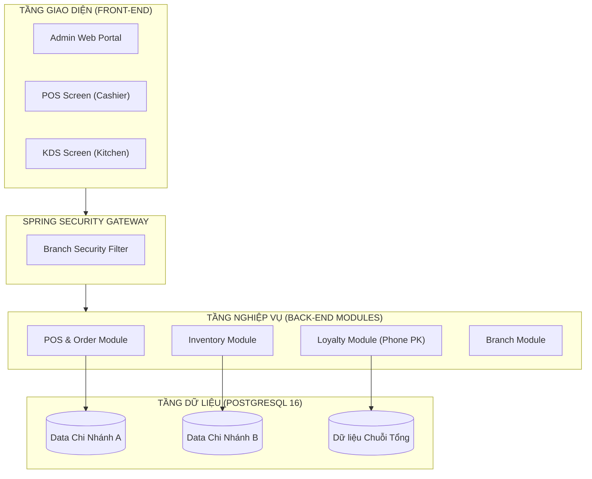
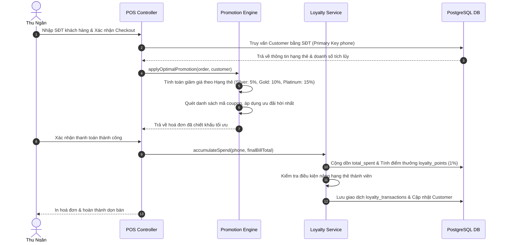

# KIẾN TRÚC HỆ THỐNG CHI TIẾT (SYSTEM ARCHITECTURE)

**Hệ Thống Quản Lý Nhà Hàng Chuỗi - SWP391**

---

| Thông Tin Tài Liệu | Chi Tiết |
| --- | --- |
| **Dự án** | Hệ Thống Quản Lý Nhà Hàng Chuỗi (RMS - Restaurant Management System) |
| **Môn học** | SWP391 - Học kỳ 5, Đại học FPT |
| **Tài liệu** | Tài Liệu Thiết Kế Kiến Trúc Hệ Thống Chi Tiết (System Architecture Document) |
| **Phiên bản** | 1.1.0 |
| **Tác giả** | Nhóm phát triển dự án SWP391 |
| **Trạng thái** | Sẵn sàng báo cáo |

---

# 1. Tổng Quan Hệ Thống (System Overview)

Hệ thống **Quản lý Nhà hàng Chuỗi (RMS)** được thiết kế theo mô hình **Modular Monolith (Kiến trúc nguyên khối phân mô-đun)**. Thiết kế này giúp hệ thống đạt được sự cân bằng tối ưu giữa tính dễ triển khai (phù hợp cho dự án môn học SWP391) và tính độc lập, bao gói cao của từng phân hệ nghiệp vụ nghiệp vụ (Auth, POS, KDS, Kho, Loyalty, HR, Thu Mua, Khuyến Mãi). 

Mỗi mô-đun nghiệp vụ tự quản lý các tầng lớp logic riêng biệt (`Controller`, `Service`, `Repository`, `Model`), chỉ giao tiếp chéo thông qua các giao diện dịch vụ (Service Interfaces) được định nghĩa sẵn, giúp giảm thiểu độ phụ thuộc chéo (Loosely Coupled).

---

# 2. Công Nghệ Sử Dụng (Technology Stack)

Hệ thống được phát triển trên nền tảng **Java 21** kết hợp với **Spring Boot 3.4+** mạnh mẽ cho phía Back-end và các template **Thymeleaf HTML5** cùng với CSS/JS thuần cho Front-end để tối ưu hóa tốc độ tải trang, đảm bảo khả năng render giao diện mượt mà mà không làm phức tạp hóa kiến trúc triển khai.

| Lớp Công Nghệ (Layer) | Công Nghệ & Thư Viện | Vai Trò & Chức Năng Chi Tiết |
| --- | --- | --- |
| **Ngôn ngữ Back-end** | Java 21 (LTS) | Sử dụng Record, Pattern Matching và Virtual Threads để nâng cao hiệu năng xử lý đa luồng. |
| **Framework cốt lõi** | Spring Boot 3.4.x | Cung cấp nền tảng quản lý Bean, Dependency Injection, Auto-configuration. |
| **Bảo mật hệ thống** | Spring Security 6.x | Quản lý đăng nhập, mã hóa BCrypt, phân quyền theo vai trò (RBAC) và kiểm soát phạm vi chi nhánh. |
| **Truy cập Dữ liệu** | Spring Data JPA & Hibernate | Ánh xạ thực thể ORM, quản lý giao dịch tự động (Transaction Management), hỗ trợ H2 & PostgreSQL. |
| **Cơ sở dữ liệu** | PostgreSQL 16 / H2 | Lưu trữ dữ liệu quan hệ, thực thi kiểm soát giao dịch ACID nghiêm ngặt cho đơn hàng và kho. |
| **Giao diện người dùng** | Thymeleaf & Vanilla CSS | Động hóa giao diện phía Server-side. CSS thuần tạo giao diện Dark Mode / Glassmorphism hiện đại. |
| **Truyền thông thời gian thực** | Spring WebSocket & STOMP | Hỗ trợ kênh truyền thông hai chiều thời gian thực giữa POS và KDS nhà bếp. |
| **Tích hợp trí tuệ nhân tạo** | Spring AI & Gemini API | Kết nối an toàn đến mô hình ngôn ngữ lớn để làm trợ lý phân tích doanh số kinh doanh. |

---

# 3. Kiến Trúc Phân Chi Nhánh & Cô Lập Dữ Liệu (Multi-Branch Architecture)

Để vận hành một chuỗi nhà hàng gồm nhiều chi nhánh con, hệ thống áp dụng cơ chế **Logical Tenant Isolation (Cô lập dữ liệu logic)** dùng chung một cơ sở dữ liệu vật lý PostgreSQL nhưng phân tách nghiêm ngặt dữ liệu bằng trường khóa ngoại `branch_id`.

### 3.1 Cơ chế Phân quyền và Lọc dữ liệu theo Chi nhánh
1. **Liên kết Người dùng - Chi nhánh**:
   Mỗi tài khoản nhân viên đăng ký trong bảng `users` được gán cố định một mã chi nhánh qua cột `branch_id`.
   - Nhân viên thu ngân (`ROLE_CASHIER`) và Quản lý chi nhánh (`ROLE_MANAGER`) bắt buộc phải có `branch_id` hợp lệ.
   - Chủ chuỗi (`ROLE_ADMIN`) có `branch_id = NULL` (Đóng vai trò là Wildcard - được toàn quyền truy cập mọi chi nhánh).
2. **Spring Security Custom Interceptor**:
   Khi người dùng thực hiện bất kỳ yêu cầu nào (HTTP Request hoặc WebSocket Connection), hệ thống sẽ đánh chặn để lấy thông tin tài khoản đăng nhập hiện tại từ Security Context:
   - Nếu người dùng là nhân viên chi nhánh, hệ thống tự động gán tham số `activeBranchId` của họ vào các câu lệnh SQL thông qua JPA (Lọc dữ liệu tự động).
   - Ví dụ: Khi thủ kho gọi danh sách nguyên liệu, JPA sẽ thực thi câu lệnh:
     `SELECT * FROM branch_inventory WHERE branch_id = :activeBranchId`
   - Nếu người dùng là **ROLE_ADMIN**, hệ thống sẽ bỏ qua bộ lọc này, cho phép truy vấn toàn bộ bảng để lập báo cáo hợp nhất.

### 3.2 WebSocket Routing Isolation (Cô lập kênh bếp KDS)
Để tránh việc đơn gọi món của chi nhánh này bị đẩy nhầm sang màn hình bếp của chi nhánh khác, WebSocket được cấu hình phân tách theo **Topic scoping**:
- Khi màn hình KDS của **Chi nhánh A** khởi động, nó sẽ đăng ký nhận tin nhắn tại địa chỉ (Topic):
  `/topic/kds/branch-branch-1`
- Khi thu ngân của **Chi nhánh A** nhấn gửi món xuống bếp, POS gửi yêu cầu đến `/api/pos/order/send`. Hệ thống xử lý lưu đơn và bắn tin nhắn WebSocket trực tiếp vào topic:
  `/topic/kds/branch-{branchId}`
- Việc gán động `{branchId}` vào đường dẫn WebSocket đảm bảo cô lập hoàn toàn luồng truyền tải thông tin chế biến giữa các nhà bếp.

---

# 4. Kiến Trúc Phân Hệ Khách Hàng Điện Thoại & Động Cơ Khuyến Mãi (Loyalty & Promotion Engine)

Hệ thống loại bỏ thiết kế surrogate ID thông thường cho khách hàng và thay thế bằng một kiến trúc hướng giao dịch cực kỳ chặt chẽ lấy **Số điện thoại (SĐT) làm định danh khóa chính**.

### 4.1 Luồng Xử lý Dữ liệu Tích lũy & Thăng hạng Tự động
1. **Kiểm tra liên kết hội viên**: Tại thời điểm thanh toán hóa đơn ở POS, hệ thống kiểm tra sự tồn tại của `customer_phone` trong phiên ăn.
2. **Khấu trừ chiết khấu trực tiếp**: 
   - Hệ thống truyền thông tin khách hàng vào `PromotionEngine`. 
   - Dựa trên giá trị của trường `membership_tier` lấy từ `customers` (được truy vấn trực tiếp bằng SĐT), hệ thống tự động trừ % hóa đơn trước khi tính thuế và trước khi áp dụng coupon ngoài.
3. **Cập nhật giao dịch sau thanh toán (Post-payment Hook)**:
   - Khi trạng thái hóa đơn đổi sang `PAID`, hệ thống kích hoạt sự kiện cập nhật điểm thông qua `LoyaltyService.accumulateSpend(phone, amount)`.
   - Dịch vụ thực hiện cộng dồn `total_spent` trực tiếp trên thực thể khách hàng và lưu vết biến động vào bảng `loyalty_transactions`.
   - Một **Bộ kiểm tra thăng hạng (Tier Upgrader Component)** chạy ngay sau đó để so sánh tổng chi tiêu mới với các mốc quy định (5 triệu cho Silver, 15 triệu cho Gold, 50 triệu cho Platinum). Nếu đủ điều kiện, trường `membership_tier` được ghi nhận giá trị mới ngay lập tức, đảm bảo khách hàng được hưởng ưu đãi cao hơn ở ngay lần mua kế tiếp.
