# TÀI LIỆU ĐẶC TẢ YÊU CẦU VÀ THIẾT KẾ HỆ THỐNG (RDS)

**Dự án**: Hệ Thống Quản Lý Nhà Hàng Chuỗi (RMS - Restaurant Management System)
**Môn học**: SWP391 - Học kỳ 5, Đại học FPT
**Tác giả**: Nhóm phát triển dự án SWP391
**Phiên bản**: 2.0.0 (Bản hoàn chỉnh tích hợp hình ảnh chức năng)

---

# 1. ĐẶC TẢ YÊU CẦU PHẦN MỀM (SOFTWARE REQUIREMENTS SPECIFICATION)

| --- |
| **Dự án** | Hệ Thống Quản Lý Nhà Hàng Chuỗi (RMS - Restaurant Management System) |
| **Môn học** | SWP391 - Học kỳ 5, Đại học FPT |
| **Tài liệu** | Đặc tả Yêu cầu Người dùng & Các Use Case Chi Tiết (SRS & Use Cases) |
| **Phiên bản** | 1.1.0 |
| **Tác giả** | Nhóm phát triển dự án SWP391 |
| **Trạng thái** | Sẵn sàng báo cáo |

---

Tài liệu này đặc tả toàn bộ các tính năng nghiệp vụ của hệ thống **Quản lý Nhà hàng Chuỗi (RMS)**. Hệ thống được nhóm chúng em xây dựng nhằm giải quyết bài toán vận hành thực tế cho chuỗi cửa hàng ẩm thực đa cơ sở. 

Tài liệu này tập trung làm rõ các phân hệ nghiệp vụ và tính năng cốt lõi phục vụ báo cáo hội đồng chấm môn học:
1. **Quản lý khách hàng thành viên lấy Số điện thoại (SĐT) làm ID duy nhất**: Tối ưu hóa việc tra cứu và quản lý hồ sơ, loại bỏ surrogate ID.
2. **Tích lũy tổng tiền hóa đơn & Tự động áp dụng ưu đãi**: Tự động tính toán tổng chi tiêu của khách hàng (`total_spent`) để phân hạng thẻ (Bronze, Silver, Gold, Platinum) và áp dụng các chính sách chiết khấu tương ứng trực tiếp tại quầy POS.
3. **Phân hệ quản trị đa chi nhánh (Multi-branch)**: Cô lập dữ liệu tồn kho, thực đơn, doanh thu theo từng chi nhánh, đồng thời hỗ trợ luồng chuyển kho nội bộ và đặt hàng từ chi nhánh con lên Kho tổng.

---

## 2. Danh Sách Epics & Use Cases Phân Chia Theo Từng Epic

Để nhóm dễ dàng phân chia công việc (Sprint Planning) và thuyết trình trước giảng viên, các yêu cầu hệ thống được quy hoạch chặt chẽ thành **10 Epic** dưới đây.

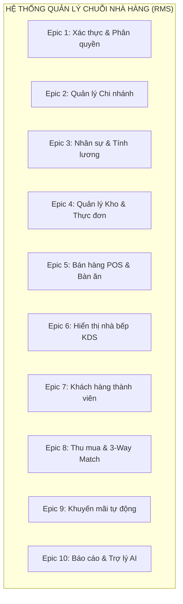

#### Epic 1: Quản lý Xác thực & Phân quyền
- **Actor**: Nhân viên, Admin, Manager.
- **Mô tả**: Đăng nhập hệ thống, cấu hình bảo mật 2 lớp (2FA), tự động khóa tài khoản khi đăng nhập sai quá 5 lần, và lưu nhật ký kiểm toán (Audit Logs).
- **Use Cases**: `UC-AUTH-01: Đăng nhập hệ thống`.

#### Epic 2: Quản lý Chi nhánh & Phân công Quản trị
- **Actor**: Chủ chuỗi (Chain Admin).
- **Mô tả**: Thiết lập thông tin chi nhánh, chỉ định tài khoản Quản lý chi nhánh (Branch Admin) quản lý trực tiếp cơ sở.

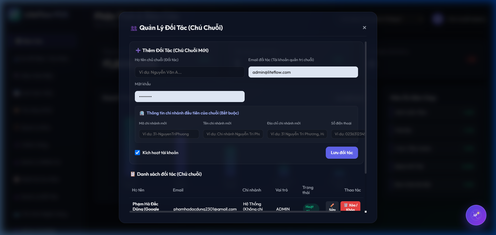

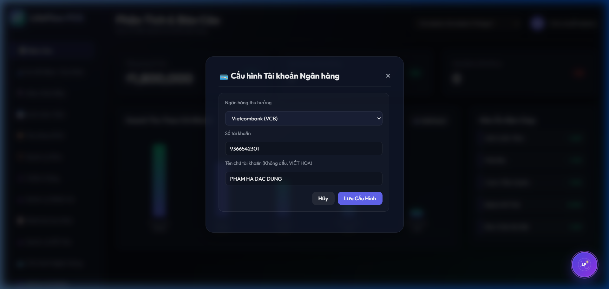
- **Use Cases**: `UC-BR-01: Cấu hình thực đơn & Giá bán theo chi nhánh`.

#### Epic 3: Quản lý Nhân sự, Ca kíp & Tính công Lương
- **Actor**: Nhân sự (HR Officer), Nhân viên phục vụ, Quản lý chi nhánh.
- **Mô tả**: Khai báo hồ sơ nhân sự, tạo ca làm việc mẫu, chấm công vào/ra ca (Clock In/Out), duyệt nghỉ phép, chạy bảng lương tự động hàng tháng.

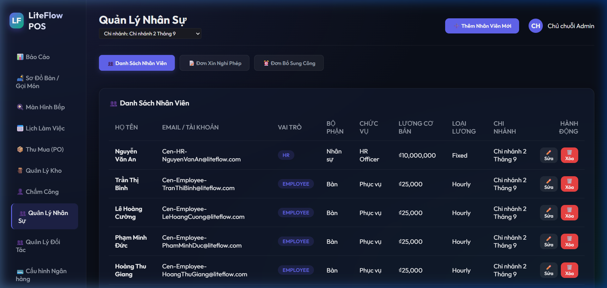

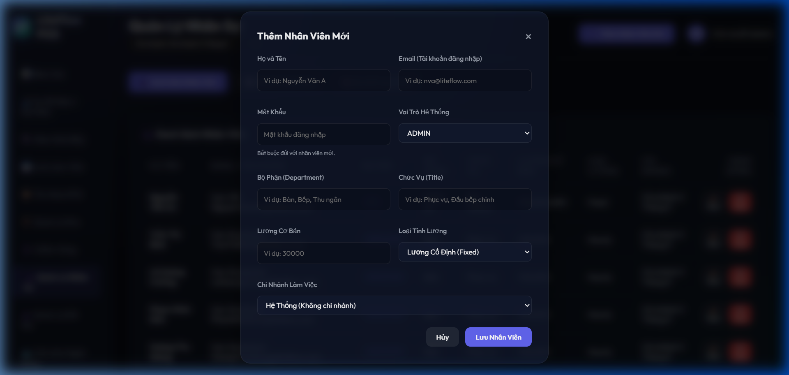

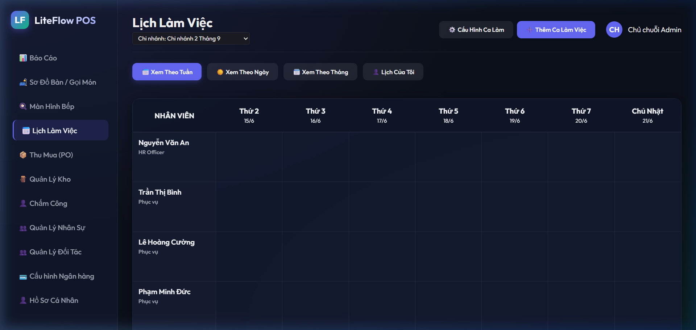

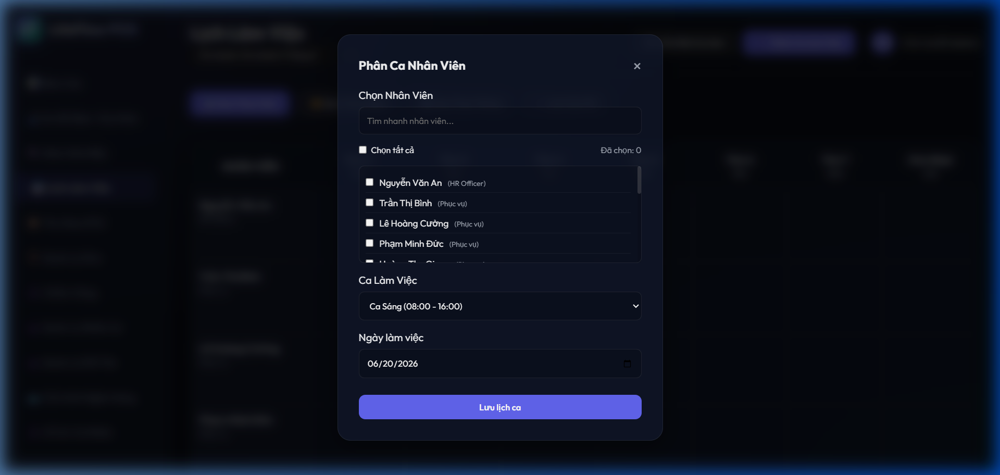
- **Use Cases**: `UC-HR-02: Chấm công vào/ra ca làm việc`.

#### Epic 4: Quản lý Kho & Định lượng Thực đơn
- **Actor**: Đầu bếp, Nhân viên kho, Quản lý chi nhánh.
- **Mô tả**: Thiết lập công thức định lượng món ăn (Recipe), điều chỉnh tồn kho do hao hụt thực tế, nhận cảnh báo hết hàng khi số lượng tồn xuống dưới ngưỡng an toàn.

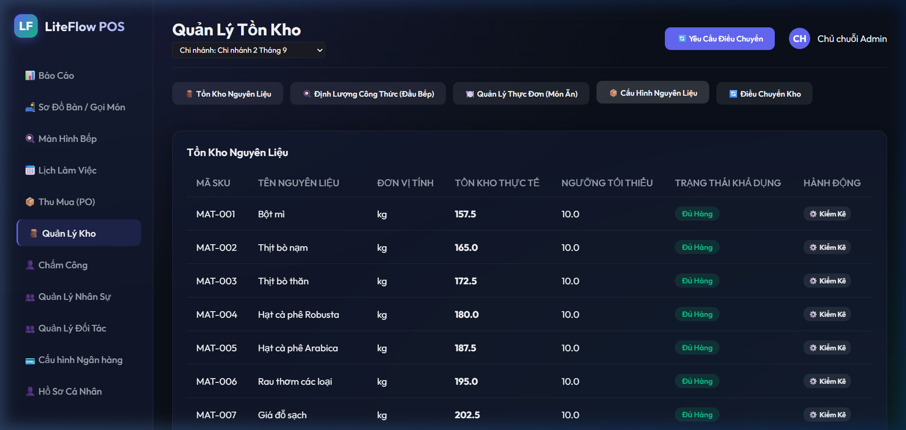

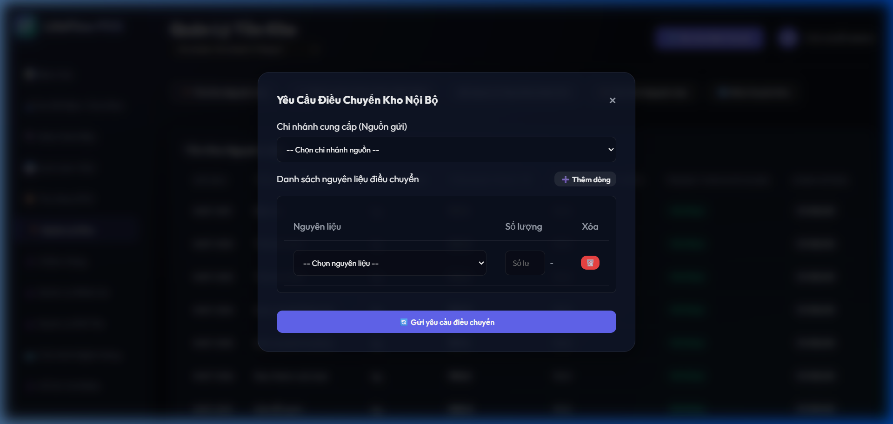
- **Use Cases**: 
  - `UC-BR-02: Tạo phiếu đặt hàng nội bộ lên Kho tổng`
  - `UC-BR-03: Chuyển kho nội bộ và đối soát hao hụt`.

#### Epic 5: Quản lý Bán hàng POS & Phiên Bàn ăn
- **Actor**: Thu ngân.
- **Mô tả**: Quản lý sơ đồ bàn ăn, mở phiên bàn ăn (Table Session), gọi món, gộp bàn (Merge Bill), tách hóa đơn (Split Bill), thanh toán VNPay QR hoặc tiền mặt.

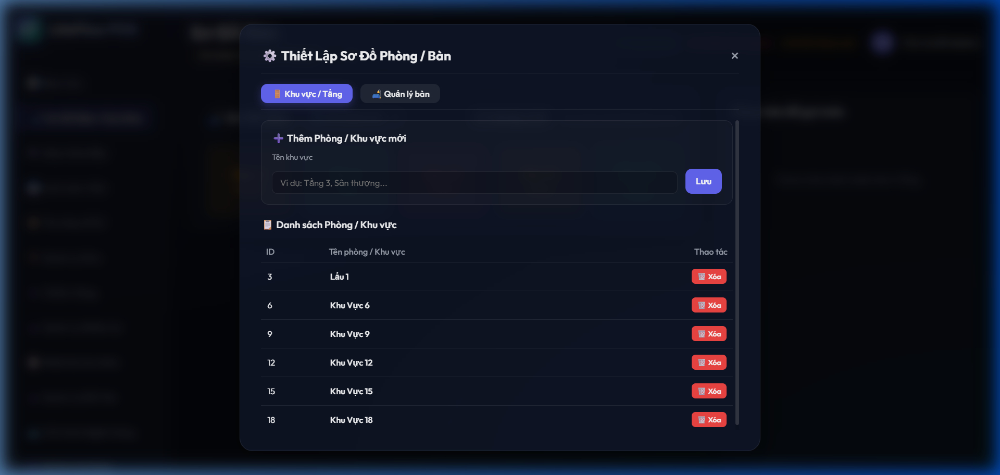

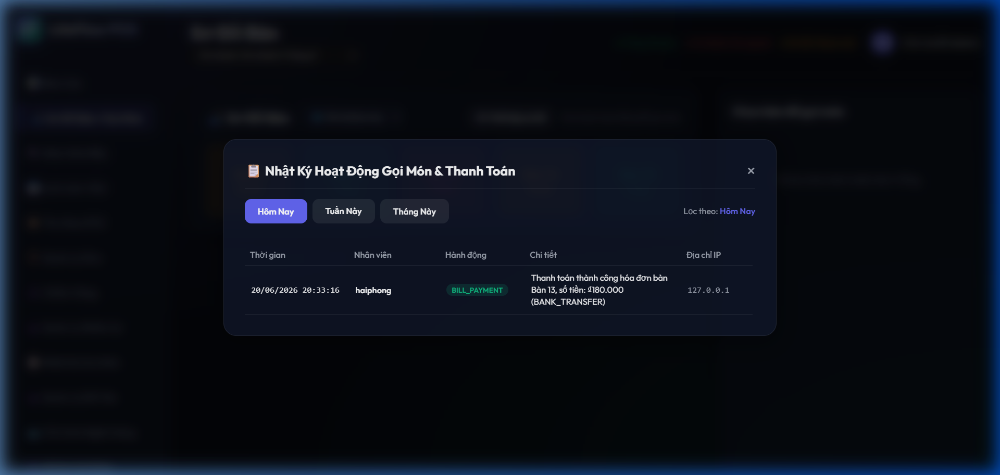
- **Use Cases**: 
  - `UC-POS-03: Gọi món và quản lý giỏ hàng bàn ăn`
  - `UC-POS-05: Thanh toán hóa đơn và đóng phiên phục vụ`.

#### Epic 6: Hệ thống hiển thị nhà bếp (KDS)
- **Actor**: Đầu bếp.
- **Mô tả**: Tiếp nhận danh sách món cần chế biến thời gian thực, cập nhật trạng thái chế biến (COOKING -> READY) đẩy thông báo WebSocket lên màn hình POS.

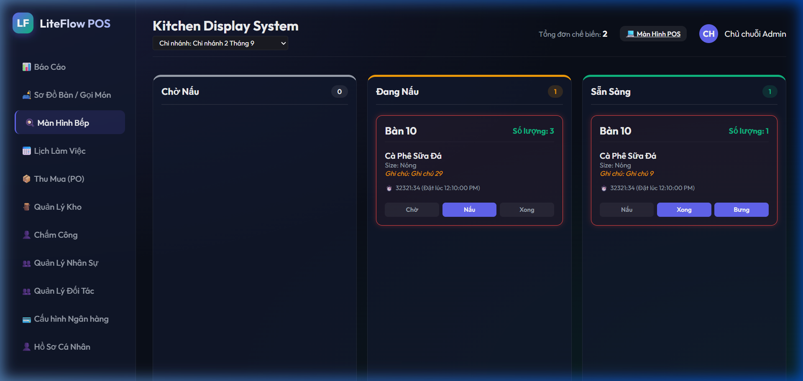

#### Epic 7: Quản lý Khách hàng thành viên & Tích lũy (Loyalty)
- **Actor**: Thu ngân, Khách hàng.
- **Mô tả**: Đăng ký hội viên mới lấy **Số điện thoại làm ID chính**, tra cứu hạng thẻ (Membership Tier) và lịch sử tích điểm thưởng thông qua Customer Portal.

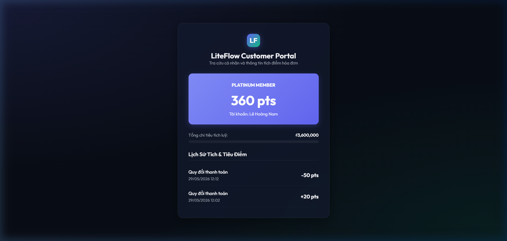
- **Use Cases**:
  - `UC-CUST-01: Đăng ký khách hàng thành viên`
  - `UC-CUST-02: Tích lũy tổng tiền hóa đơn & Tự động xếp hạng thành viên`.

#### Epic 8: Quản lý Thu mua & Đối chiếu 3 bên
- **Actor**: Nhân viên mua hàng, Thủ kho, Quản lý chi nhánh.
- **Mô tả**: Lập đơn đặt mua PO gửi Supplier, nhận hàng lập phiếu nhập kho GRN, thực hiện quy trình Three-way Matching tự động đối soát tránh thất thoát tài chính.

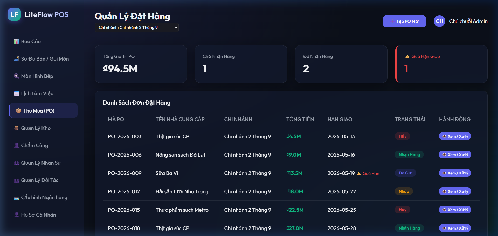

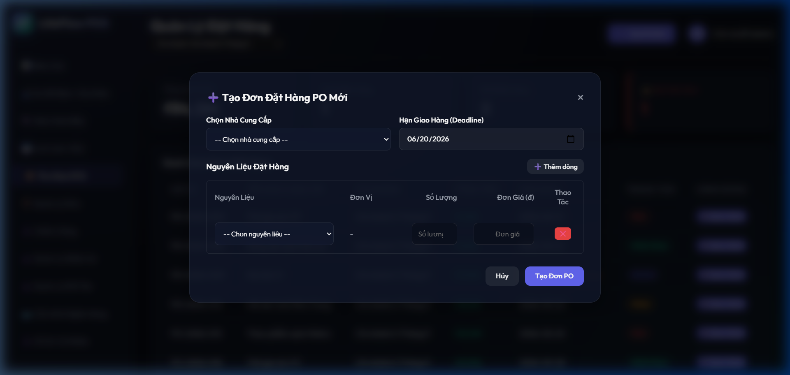

#### Epic 9: Quản lý Khuyến mãi & Áp dụng tự động
- **Actor**: Quản lý chi nhánh, Khách hàng.
- **Mô tả**: Cấu hình mã giảm giá (Flat, Percent, Buy-1-Get-1), hệ thống tự động quét giỏ hàng để áp dụng chương trình chiết khấu tối ưu nhất.

#### Epic 10: Báo cáo Thống kê & Trợ lý AI Assistant
- **Actor**: Chủ chuỗi, Quản lý chi nhánh.
- **Mô tả**: Hiển thị dashboard doanh số và kho hàng đa chi nhánh, chat trực quan với AI Assistant để nhận phân tích dữ liệu kinh doanh thông minh.

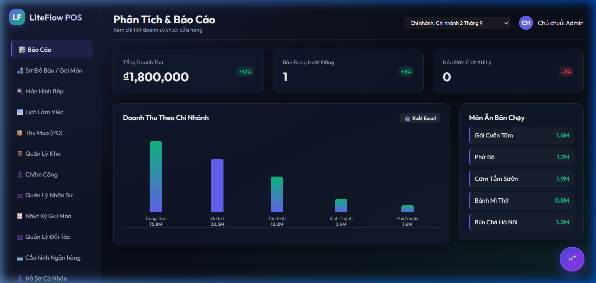

---

## 3. Thiết Kế Các Use Case Chi Tiết (Use Case Specifications)

Dưới đây là đặc tả chi tiết các Use Case cốt lõi của hệ thống. Mỗi Use Case được trình bày dưới dạng bảng chuẩn hóa gồm tiền điều kiện, hậu điều kiện, luồng xử lý chính và các luồng thay thế.

---

#### UC-AUTH-01: Đăng nhập hệ thống

| Đặc tính Use Case | Chi tiết đặc tả |
| --- | --- |
| **Use Case ID / Name** | **UC-AUTH-01: Đăng nhập hệ thống** |
| **Thuộc Epic** | Epic 1: Quản lý Xác thực & Phân quyền |
| **Tác nhân chính** | Mọi nhân viên (Nhân viên phục vụ, Thu ngân, Đầu bếp, HR, Quản lý, Admin) |
| **Tiền điều kiện** | Tài khoản nhân viên đã được kích hoạt trên hệ thống (`isActive = true`). |
| **Hậu điều kiện** | Tạo phiên làm việc mới, phân quyền truy cập chức năng tương ứng với vai trò. |

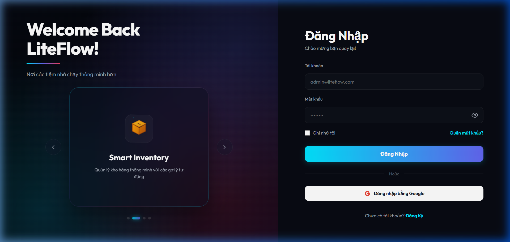

**Luồng xử lý chính (Main Flow):**
1. Người dùng truy cập trang đăng nhập `/login`, điền thông tin **Email** và **Mật khẩu**.
2. Người dùng nhấn nút **Đăng nhập**.
3. Hệ thống kiểm tra tài khoản trong bảng `users`:
   - Xác thực mật khẩu qua cơ chế `BCryptPasswordEncoder`.
   - Nếu đúng: Tạo bản ghi phiên làm việc trong `user_sessions`, cập nhật `failed_login_attempts = 0`.
   - Đọc các quyền hạn (Roles) của người dùng liên kết qua bảng `user_roles`.
4. Hệ thống chuyển hướng người dùng về trang chức năng tương ứng (Ví dụ: Cashier -> `/pos`, Đầu bếp -> `/kds`, Admin -> `/dashboard`). Ghi nhật ký audit log đăng nhập thành công.

**Luồng thay thế (Alternative Flow):**
- **[Alt-1] Đăng nhập thất bại (Sai mật khẩu hoặc email)**: Hệ thống tăng `failed_login_attempts` lên 1. Nếu số lần sai đạt 5, hệ thống chuyển `is_active = false`, thiết lập thời gian hết hạn khóa trong cơ sở dữ liệu và thông báo: *"Tài khoản của bạn đã bị khóa tạm thời trong 15 phút do vượt quá số lần thử đăng nhập."*

---

#### UC-HR-02: Chấm công vào/ra ca làm việc

| Đặc tính Use Case | Chi tiết đặc tả |
| --- | --- |
| **Use Case ID / Name** | **UC-HR-02: Chấm công vào/ra ca làm việc** |
| **Thuộc Epic** | Epic 3: Quản lý Nhân sự, Ca kíp & Tính công Lương |
| **Tác nhân chính** | Nhân viên phục vụ / Thu ngân / Đầu bếp |
| **Tiền điều kiện** | Nhân viên đã đăng nhập hệ thống thành công và đang có ca làm việc được phân công hôm nay. |
| **Hậu điều kiện** | Bản ghi chấm công (`employee_attendances`) được khởi tạo hoặc cập nhật giờ ra ca chính xác. |

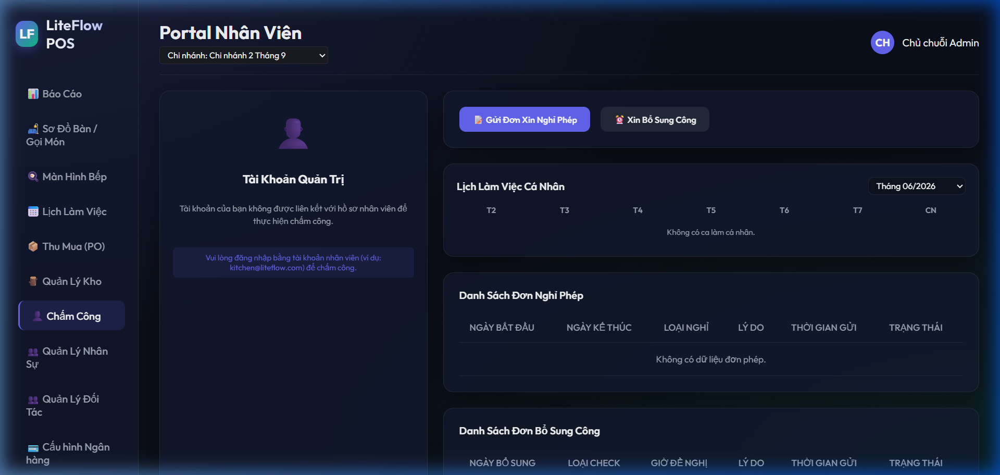

**Luồng xử lý chính (Main Flow):**
1. Nhân viên truy cập phân hệ chấm công cá nhân.
2. **Clock In (Đầu ca)**: Nhân viên nhấn nút **Clock In**:
   - Hệ thống ghi nhận thời gian hiện tại vào cột `clock_in` trong bảng `employee_attendances`.
   - So sánh với giờ bắt đầu trong `shift_templates`. Nếu đến trễ hơn ca quy định, tự động đánh dấu `is_late = true`.
3. **Clock Out (Cuối ca)**: Hết ca làm việc, nhân viên nhấn nút **Clock Out**:
   - Hệ thống tìm kiếm bản ghi chấm công đang mở của ngày hôm nay.
   - Ghi nhận thời gian hiện tại vào cột `clock_out`.
   - Tính toán số giờ làm việc thực tế (`hours_worked`) và kiểm tra xem có về sớm không để đánh dấu `is_early_leave = true`.
4. Trả về thông báo ghi nhận thành công và hiển thị tổng số giờ công tạm tính.

---

#### UC-POS-03: Gọi món và quản lý giỏ hàng bàn ăn

| Đặc tính Use Case | Chi tiết đặc tả |
| --- | --- |
| **Use Case ID / Name** | **UC-POS-03: Gọi món và quản lý giỏ hàng bàn ăn** |
| **Thuộc Epic** | Epic 5: Quản lý Bán hàng POS & Bàn ăn |
| **Tác nhân chính** | Thu ngân (hoặc Nhân viên phục vụ tại bàn) |
| **Tiền điều kiện** | Bàn ăn đã được mở phiên làm việc (`table_sessions.status = 'ACTIVE'`). |
| **Hậu điều kiện** | Các bản ghi `order_details` được cập nhật món và số lượng tương ứng chính xác. |

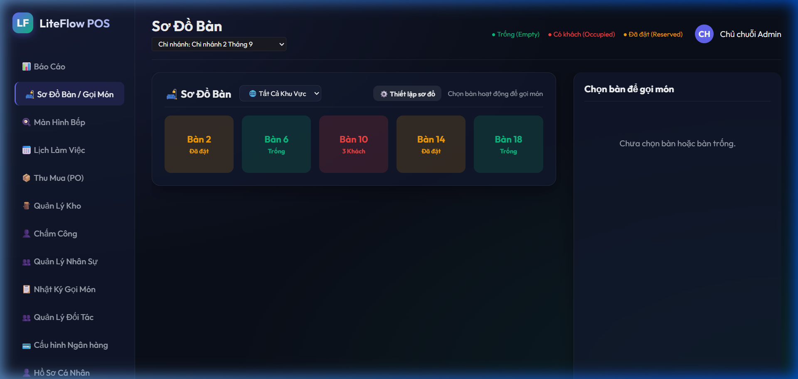

**Luồng xử lý chính (Main Flow):**
1. Thu ngân chọn bàn ăn trên sơ đồ màn hình POS.
2. Thu ngân nhấp vào danh mục món ăn (Category) và chọn một sản phẩm cùng các tùy chọn biến thể (Size, Đá, Nóng, Topping).
3. Thu ngân nhấn **Thêm vào giỏ**:
   - Hệ thống gọi API `POST /api/pos/order/add`.
   - Kiểm tra xem sản phẩm đã có trong phiên gọi món hiện tại chưa. Nếu có, tăng số lượng `quantity`. Nếu chưa, tạo dòng `order_details` mới.
4. Hệ thống chạy cơ chế khuyến mãi tự động `PromotionEngine.processBuyOneGetOne`: Nếu đơn hàng chứa sản phẩm kích hoạt (Ví dụ: Mua 1 Ly Cà Phê Sữa Size Lớn), hệ thống tự động thêm món tặng (Ví dụ: Bánh Flan ngọt) với đơn giá `0.0` và đánh dấu `is_deducted = false`.
5. Thu ngân xác nhận và nhấn nút **Gửi bếp** để đẩy thông tin sang KDS.

---

#### UC-POS-05: Thanh toán hóa đơn và đóng phiên phục vụ

| Đặc tính Use Case | Chi tiết đặc tả |
| --- | --- |
| **Use Case ID / Name** | **UC-POS-05: Thanh toán hóa đơn và đóng phiên phục vụ** |
| **Thuộc Epic** | Epic 5: Quản lý Bán hàng POS & Bàn ăn |
| **Tác nhân chính** | Thu ngân |
| **Tiền điều kiện** | Phiên bàn ăn đang hoạt động và có ít nhất 1 món ăn trong hóa đơn. |
| **Hậu điều kiện** | Thanh toán thành công, giải phóng trạng thái bàn ăn, tự động cộng điểm tích lũy cho khách hàng. |

**Luồng xử lý chính (Main Flow):**
1. Thu ngân nhấn nút **Checkout (Thanh toán)** trên màn hình POS.
2. Hệ thống thực hiện các tính toán sau:
   - Tính tổng tiền món ăn tạm tính (`total_amount`).
   - Kiểm tra xem phiên bàn ăn có liên kết số điện thoại khách hàng thành viên không. Nếu có, tự động áp dụng chính sách chiết khấu theo thứ tự ưu đãi: **Membership Discount** (Bronze: 0%, Silver: 5%, Gold: 10%, Platinum: 15% trừ thẳng hóa đơn) kết hợp quét mã giảm giá hời nhất qua `PromotionEngine.applyOptimalPromotion`.
3. Thu ngân chọn phương thức thanh toán: **Tiền mặt** hoặc **Quét mã VNPay QR**.
4. Khi nhận được xác nhận thanh toán thành công (hoặc phản hồi IPN từ VNPay):
   - Cập nhật hóa đơn `orders.status = 'SERVED'`.
   - Cập nhật phiên bàn ăn `table_sessions.status = 'COMPLETED'`, `payment_status = 'PAID'`.
   - Giải phóng bàn ăn: `tables.status = 'EMPTY'`, `guest_count = 0`.
   - Gọi hàm `LoyaltyService.accumulateSpend(phone, billTotal)`: Cộng dồn `total_spent` của khách hàng theo số điện thoại, tự động kích hoạt nâng hạng thành viên nếu vượt ngưỡng chi tiêu, và cộng điểm tích lũy (1% tổng hóa đơn).
5. Hệ thống in hóa đơn (Receipt) cho khách hàng và đóng phiên bàn ăn.

---

#### UC-CUST-01: Đăng ký khách hàng thành viên

| Đặc tính Use Case | Chi tiết đặc tả |
| --- | --- |
| **Use Case ID / Name** | **UC-CUST-01: Đăng ký khách hàng thành viên** |
| **Thuộc Epic** | Epic 7: Quản lý Khách hàng thành viên & Tích lũy (Loyalty) |
| **Tác nhân chính** | Thu ngân |
| **Tiền điều kiện** | Khách hàng chưa có tài khoản thành viên trong hệ thống. |
| **Hậu điều kiện** | Tạo mới bản ghi khách hàng với khóa chính là Số điện thoại trên cơ sở dữ liệu. |

**Luồng xử lý chính (Main Flow):**
1. Khi khách hàng mua hàng tại quầy và có nhu cầu tích điểm, Thu ngân mở biểu mẫu đăng ký hội viên (`POST /api/pos/customer/register`).
2. Thu ngân nhập các thông tin do khách cung cấp: **Số điện thoại (SĐT)**, **Họ tên**, và **Ngày sinh** (tùy chọn).
3. Thu ngân nhấn **Xác nhận đăng ký**.
4. Hệ thống kiểm tra tính hợp lệ:
   - Kiểm tra xem Số điện thoại đã tồn tại trong bảng `customers` chưa (tra cứu trực tiếp bằng khóa chính `phone`).
   - Nếu chưa tồn tại: Tạo thực thể `Customer` mới với `phone` làm khóa chính. Thiết lập giá trị mặc định: `membership_tier = 'Bronze'`, `loyalty_points = 0`, `total_spent = 0.0`.
5. Hệ thống trả về thông báo đăng ký thành công. Kể từ hóa đơn này, khách hàng có thể đọc SĐT để nhân viên nhập trực tiếp khi mở bàn ăn nhằm tích lũy doanh số.

**Luồng thay thế (Alternative Flow):**
- **[Alt-1] Trùng số điện thoại**: Nếu hệ thống phát hiện số điện thoại đã tồn tại làm khóa chính, hệ thống sẽ trả về lỗi: *"Số điện thoại này đã được đăng ký thành viên trước đó. Họ tên hội viên: Nguyễn Văn A. Hạng thẻ: Silver."* và hiển thị thông tin để thu ngân liên kết ngay vào bàn ăn mà không cần tạo mới.

---

#### UC-CUST-02: Tích lũy tổng tiền hóa đơn & Tự động xếp hạng thành viên

| Đặc tính Use Case | Chi tiết đặc tả |
| --- | --- |
| **Use Case ID / Name** | **UC-CUST-02: Tích lũy tổng tiền hóa đơn & Tự động xếp hạng** |
| **Thuộc Epic** | Epic 7: Quản lý Khách hàng thành viên & Tích lũy (Loyalty) |
| **Tác nhân chính** | Hệ thống (Tự động kích hoạt khi thanh toán hóa đơn hoàn tất) |
| **Tiền điều kiện** | Đơn hàng của bàn ăn được liên kết với số điện thoại của hội viên hoạt động. |
| **Hậu điều kiện** | Cập nhật `total_spent`, tự động nâng hạng thẻ (`membership_tier`) và điểm tích lũy của hội viên. |

**Luồng xử lý chính (Main Flow):**
1. Khi có sự kiện thanh toán hóa đơn hoàn tất (trong `UC-POS-05`), hệ thống nhận giá trị tổng tiền thanh toán thực tế của khách (`total_amount`).
2. Hệ thống gọi hàm dịch vụ `LoyaltyService.accumulateSpend(String phone, Double amount)`:
   - Truy vấn thông tin khách hàng từ bảng `customers` bằng khóa chính `phone`.
   - Thực hiện cộng dồn: `new_total_spent = total_spent + amount`.
   - Tính điểm thưởng mới: `loyalty_points = loyalty_points + (amount * 0.01)` (1% số tiền hóa đơn quy đổi thành điểm).
   - Lưu một giao dịch tích lũy điểm thưởng vào bảng `loyalty_transactions` với loại `EARNED`.
3. Hệ thống thực hiện kiểm tra thăng hạng thẻ tự động dựa trên tổng chi tiêu tích lũy (`new_total_spent`):
   - Nếu `new_total_spent >= 50.000.000 VNĐ`: Nâng cấp lên **Platinum** (Ưu đãi giảm 15% hóa đơn sau).
   - Nếu `new_total_spent >= 15.000.000 VNĐ` và `< 50.000.000 VNĐ`: Nâng cấp lên **Gold** (Ưu đãi giảm 10% hóa đơn sau).
   - Nếu `new_total_spent >= 5.000.000 VNĐ` và `< 15.000.000 VNĐ`: Nâng cấp lên **Silver** (Ưu đãi giảm 5% hóa đơn sau).
   - Nếu `< 5.000.000 VNĐ`: Hạng thẻ giữ nguyên là **Bronze** (Giảm 0%).
4. Cập nhật các trường thông tin thay đổi vào bảng `customers` trong cơ sở dữ liệu. Ghi nhật ký audit log thăng hạng nếu hạng thẻ của hội viên có sự thay đổi.

---

#### UC-BR-01: Cấu hình thực đơn & Giá bán theo chi nhánh

| Đặc tính Use Case | Chi tiết đặc tả |
| --- | --- |
| **Use Case ID / Name** | **UC-BR-01: Cấu hình thực đơn & Giá bán theo chi nhánh** |
| **Thuộc Epic** | Epic 2: Quản lý Chi nhánh & Phân công Quản trị |
| **Tác nhân chính** | Chủ chuỗi (Chain Admin) / Quản lý chi nhánh (Branch Manager) |
| **Tiền điều kiện** | Các chi nhánh (`branches`) và biến thể thực đơn (`product_variants`) đã được khai báo trên hệ thống. |
| **Hậu điều kiện** | Giá bán và trạng thái món được áp dụng riêng biệt cho từng chi nhánh cụ thể thành công. |

**Luồng xử lý chính (Main Flow):**
1. Quản lý truy cập trang cấu hình thực đơn chi nhánh (`/inventory/menu`).
2. Quản lý chọn chi nhánh mục tiêu cần cấu hình (Nếu là Branch Manager, hệ thống tự động khóa và chọn chi nhánh hiện tại mà tài khoản được gán trong bảng `users.branch_id`).
3. Hệ thống hiển thị danh sách toàn bộ các món ăn và biến thể.
4. Quản lý chọn một biến thể món ăn (`ProductVariant`) và thực hiện cấu hình:
   - Điền giá bán lẻ áp dụng riêng cho chi nhánh (`custom_price`) để bù đắp sự chênh lệch chi phí vận hành địa phương.
   - Bật hoặc tắt trạng thái kinh doanh (`is_available = true/false`) tùy thuộc vào nguồn cung nguyên liệu thô tại địa phương.
5. Quản lý nhấn **Lưu cấu hình**:
   - Hệ thống ghi nhận thông tin vào bảng liên kết `branch_product_prices`.
   - Kể từ thời điểm này, khi thu ngân chi nhánh mở màn hình POS gọi món, hệ thống sẽ truy vấn bảng `branch_product_prices` trước để hiển thị giá bán tùy biến thay vì lấy giá gốc mặc định trong bảng `product_variants`.

---

#### UC-BR-02: Tạo phiếu đặt hàng nội bộ lên Kho tổng

| Đặc tính Use Case | Chi tiết đặc tả |
| --- | --- |
| **Use Case ID / Name** | **UC-BR-02: Tạo phiếu đặt hàng nội bộ lên Kho tổng** |
| **Thuộc Epic** | Epic 4: Quản lý Kho & Định lượng Thực đơn |
| **Tác nhân chính** | Quản lý chi nhánh con (Branch Manager) |
| **Tiền điều kiện** | Chi nhánh Kho tổng đã được định nghĩa (`branches.is_warehouse = true`). Tồn kho chi nhánh con xuống thấp. |
| **Hậu điều kiện** | Phiếu yêu cầu đặt hàng nội bộ (IPO) được gửi lên Kho tổng thành công ở trạng thái `SUBMITTED`. |

**Luồng xử lý chính (Main Flow):**
1. Hệ thống gửi thông báo cảnh báo đến Quản lý chi nhánh khi số lượng tồn kho nguyên liệu trong bảng `branch_inventory` tụt dưới ngưỡng cảnh báo `reorder_point`.
2. Quản lý chi nhánh con nhấp vào thông báo và chọn chức năng **Đặt hàng nội bộ lên Kho tổng** (`POST /api/procurement/ipo/create`).
3. Quản lý chọn danh sách các nguyên vật liệu thô cần bổ sung từ bảng `inventory_items` và điền số lượng tương ứng.
4. Quản lý nhấn **Gửi yêu cầu bổ sung**:
   - Hệ thống tự động tạo mã đơn hàng nội bộ duy nhất `ipo_code` (Ví dụ: `IPO-2026-004`).
   - Thiết lập `requester_branch_id` là mã chi nhánh con hiện tại, `warehouse_id` là mã chi nhánh Kho tổng.
   - Ghi nhận trạng thái phiếu `status = 'SUBMITTED'` và lưu vào bảng `internal_purchase_orders` cùng chi tiết trong `internal_purchase_order_items`.
5. Đơn hàng nội bộ được chuyển tiếp sang danh sách hàng chờ xử lý của Thủ kho Kho tổng để lên phương án chuẩn bị xuất hàng.

---

#### UC-BR-03: Chuyển kho nội bộ và đối soát hao hụt

| Đặc tính Use Case | Chi tiết đặc tả |
| --- | --- |
| **Use Case ID / Name** | **UC-BR-03: Chuyển kho nội bộ và đối soát hao hụt** |
| **Thuộc Epic** | Epic 4: Quản lý Kho & Định lượng Thực đơn |
| **Tác nhân chính** | Quản lý chi nhánh xuất (Kho nguồn) và Quản lý chi nhánh nhận (Kho đích) |
| **Tiền điều kiện** | Phiếu chuyển kho đã được tạo lập ở trạng thái chờ gửi đi. |
| **Hậu điều kiện** | Tồn kho của 2 chi nhánh được cập nhật, ghi nhận chênh lệch hao hụt trong quá trình vận chuyển. |

**Luồng xử lý chính (Main Flow):**
1. **Bước 1 (Xuất kho đi)**: Quản lý chi nhánh xuất kiểm đếm hàng hóa thực tế và nhấn nút **Xác nhận gửi đi** (`POST /api/inventory/transfers/{id}/ship`):
   - Hệ thống tự động giảm ngay lập tức số lượng nguyên liệu tương ứng trong bảng `branch_inventory` của chi nhánh xuất.
   - Chuyển trạng thái phiếu chuyển kho `branch_transfers.status = 'SHIPPED'`, cập nhật `shipped_date` và ghi nhận số lượng gửi đi `quantity_shipped`. Lượng hàng này chính thức nằm ở trạng thái đang vận chuyển (In-transit).
2. **Bước 2 (Nhận kho & Đối soát)**: Khi hàng hóa được vận chuyển đến chi nhánh nhận, Quản lý chi nhánh nhận kiểm đếm số lượng thực tế nhận được và điền thông tin vào biểu mẫu:
   - Nhập số lượng thực nhận (`quantity_received`).
   - Nhập lý do hao hụt (`loss_reason`) nếu có sự chênh lệch do hư hỏng, rơi vỡ trong quá trình vận chuyển.
3. Quản lý chi nhánh nhận nhấn nút **Hoàn tất nhập kho** (`POST /api/inventory/transfers/{id}/receive`):
   - Hệ thống tính toán hao hụt: `loss_quantity = quantity_shipped - quantity_received`.
   - Hệ thống cộng số lượng thực nhận `quantity_received` vào tồn kho trong bảng `branch_inventory` của chi nhánh đích.
   - Ghi nhật ký lịch sử thay đổi tồn kho `inventory_logs` cho cả 2 chi nhánh (`STOCKOUT` tại kho nguồn và `STOCKIN` tại kho đích).
   - Đổi trạng thái phiếu chuyển kho sang `status = 'RECEIVED'`.
---

#### UC-USER-01: Xem hồ sơ cá nhân và đổi mật khẩu

| Đặc tính Use Case | Chi tiết đặc tả |
| --- | --- |
| **Use Case ID / Name** | **UC-USER-01: Xem hồ sơ cá nhân và đổi mật khẩu** |
| **Thuộc Epic** | Epic 1: Quản lý Xác thực & Phân quyền |
| **Tác nhân chính** | Mọi nhân viên (Nhân viên phục vụ, Thu ngân, Đầu bếp, HR, Quản lý, Admin) |
| **Tiền điều kiện** | Nhân viên đã đăng nhập hệ thống thành công. |
| **Hậu điều kiện** | Đổi mật khẩu cá nhân thành công, lưu vết kiểm toán và cập nhật CSDL. |

**Luồng xử lý chính (Main Flow):**
1. Nhân viên nhấp chuột vào avatar/logo cá nhân ở góc trên cùng bên phải màn hình.
2. Hệ thống tải thông tin cá nhân hiện tại từ bảng `employees` và `users` (Họ tên, Email, Chức vụ, Phòng ban, Lương cơ bản, Ngày vào làm).
3. Hệ thống hiển thị trang Hồ sơ cá nhân (`/profile`) gồm 2 cột: thông tin cá nhân và biểu mẫu đổi mật khẩu.
4. Nhân viên nhập mật khẩu cũ, mật khẩu mới và xác nhận mật khẩu mới.
5. Nhân viên nhấn nút **Cập nhật mật khẩu**:
   - Hệ thống đối chiếu mật khẩu cũ. Nếu đúng, mã hóa mật khẩu mới bằng BCrypt và lưu vào bảng `users`.
   - Lưu nhật ký audit log hành động đổi mật khẩu thành công.
6. Hiển thị thông báo Toast thành công.

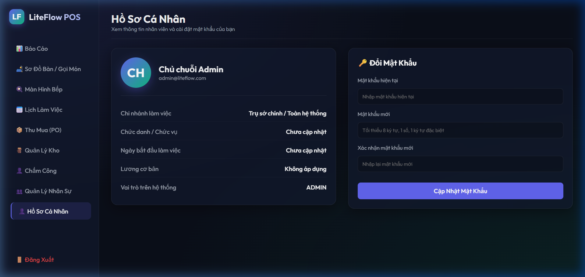

---

# 2. THIẾT KẾ KIẾN TRÚC HỆ THỐNG (SYSTEM ARCHITECTURE)

| --- |
| **Dự án** | Hệ Thống Quản Lý Nhà Hàng Chuỗi (RMS - Restaurant Management System) |
| **Môn học** | SWP391 - Học kỳ 5, Đại học FPT |
| **Tài liệu** | Tài Liệu Thiết Kế Kiến Trúc Hệ Thống Chi Tiết (System Architecture Document) |
| **Phiên bản** | 1.1.0 |
| **Tác giả** | Nhóm phát triển dự án SWP391 |
| **Trạng thái** | Sẵn sàng báo cáo |

---

Hệ thống **Quản lý Nhà hàng Chuỗi (RMS)** được thiết kế theo mô hình **Modular Monolith (Kiến trúc nguyên khối phân mô-đun)**. Thiết kế này giúp hệ thống đạt được sự cân bằng tối ưu giữa tính dễ triển khai (phù hợp cho dự án môn học SWP391) và tính độc lập, bao gói cao của từng phân hệ nghiệp vụ nghiệp vụ (Auth, POS, KDS, Kho, Loyalty, HR, Thu Mua, Khuyến Mãi). 

Mỗi mô-đun nghiệp vụ tự quản lý các tầng lớp logic riêng biệt (`Controller`, `Service`, `Repository`, `Model`), chỉ giao tiếp chéo thông qua các giao diện dịch vụ (Service Interfaces) được định nghĩa sẵn, giúp giảm thiểu độ phụ thuộc chéo (Loosely Coupled).

---

## 2. Công Nghệ Sử Dụng (Technology Stack)

Hệ thống được phát triển trên nền tảng **Java 21** kết hợp với **Spring Boot 3.4+** mạnh mẽ cho phía Back-end và các template **Thymeleaf HTML5** cùng với CSS/JS thuần cho Front-end để tối ưu hóa tốc độ tải trang, đảm bảo khả năng render giao diện mượt mà mà không làm phức tạp hóa kiến trúc triển khai.

| Lớp Công Nghệ (Layer) | Công Nghệ & Thư Viện | Vai Trò & Chức Năng Chi Tiết |
| --- | --- | --- |
| **Ngôn ngữ Back-end** | Java 21 (LTS) | Sử dụng Record, Pattern Matching và Virtual Threads để nâng cao hiệu năng xử lý đa luồng. |
| **Framework cốt lõi** | Spring Boot 3.4.x | Cung cấp nền tảng quản lý Bean, Dependency Injection, Auto-configuration. |
| **Bảo mật hệ thống** | Spring Security 6.x | Quản lý đăng nhập, mã hóa BCrypt, phân quyền theo vai trò (RBAC) và kiểm soát phạm vi chi nhánh. |
| **Truy cập Dữ liệu** | Spring Data JPA & Hibernate | Ánh xạ thực thể ORM, quản lý giao dịch tự động (Transaction Management), hỗ trợ H2 & PostgreSQL. |
| **Cơ sở dữ liệu** | PostgreSQL 16 / H2 | Lưu trữ dữ liệu quan hệ, thực thi kiểm soát giao dịch ACID nghiêm ngặt cho đơn hàng và kho. |
| **Giao diện người dùng** | Thymeleaf & Vanilla CSS | Động hóa giao diện phía Server-side. CSS thuần tạo giao diện Dark Mode / Glassmorphism hiện đại. |
| **Truyền thông thời gian thực** | Spring WebSocket & STOMP | Hỗ trợ kênh truyền thông hai chiều thời gian thực giữa POS và KDS nhà bếp. |
| **Tích hợp trí tuệ nhân tạo** | Spring AI & Gemini API | Kết nối an toàn đến mô hình ngôn ngữ lớn để làm trợ lý phân tích doanh số kinh doanh. |

---

## 3. Kiến Trúc Phân Chi Nhánh & Cô Lập Dữ Liệu (Multi-Branch Architecture)

Để vận hành một chuỗi nhà hàng gồm nhiều chi nhánh con, hệ thống áp dụng cơ chế **Logical Tenant Isolation (Cô lập dữ liệu logic)** dùng chung một cơ sở dữ liệu vật lý PostgreSQL nhưng phân tách nghiêm ngặt dữ liệu bằng trường khóa ngoại `branch_id`.

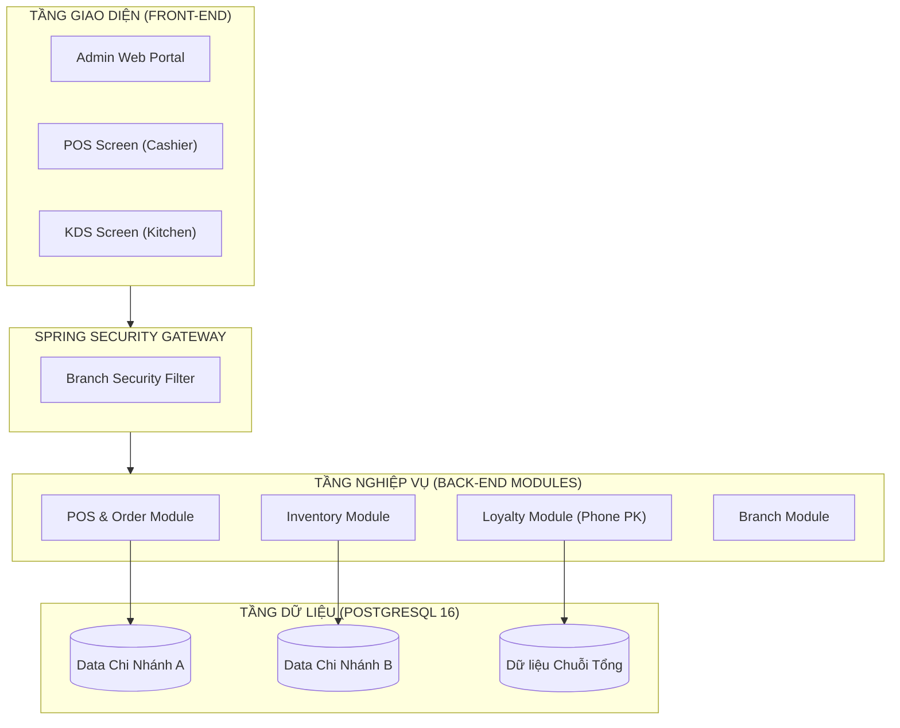

#### 3.1 Cơ chế Phân quyền và Lọc dữ liệu theo Chi nhánh
1. **Liên kết Người dùng - Chi nhánh**:
   Mỗi tài khoản nhân viên đăng ký trong bảng `users` được gán cố định một mã chi nhánh qua cột `branch_id`.
   - Nhân viên thu ngân (`ROLE_CASHIER`) và Quản lý chi nhánh (`ROLE_MANAGER`) bắt buộc phải có `branch_id` hợp lệ.
   - Chủ chuỗi (`ROLE_ADMIN`) có `branch_id = NULL` (Đóng vai trò là Wildcard - được toàn quyền truy cập mọi chi nhánh).
2. **Spring Security Custom Interceptor**:
   Khi người dùng thực hiện bất kỳ yêu cầu nào (HTTP Request hoặc WebSocket Connection), hệ thống sẽ đánh chặn để lấy thông tin tài khoản đăng nhập hiện tại từ Security Context:
   - Nếu người dùng là nhân viên chi nhánh, hệ thống tự động gán tham số `activeBranchId` của họ vào các câu lệnh SQL thông qua JPA (Lọc dữ liệu tự động).
   - Ví dụ: Khi thủ kho gọi danh sách nguyên liệu, JPA sẽ thực thi câu lệnh:
     `SELECT * FROM branch_inventory WHERE branch_id = :activeBranchId`
   - Nếu người dùng là **ROLE_ADMIN**, hệ thống sẽ bỏ qua bộ lọc này, cho phép truy vấn toàn bộ bảng để lập báo cáo hợp nhất.

#### 3.2 WebSocket Routing Isolation (Cô lập kênh bếp KDS)
Để tránh việc đơn gọi món của chi nhánh này bị đẩy nhầm sang màn hình bếp của chi nhánh khác, WebSocket được cấu hình phân tách theo **Topic scoping**:
- Khi màn hình KDS của **Chi nhánh A** khởi động, nó sẽ đăng ký nhận tin nhắn tại địa chỉ (Topic):
  `/topic/kds/branch-branch-1`
- Khi thu ngân của **Chi nhánh A** nhấn gửi món xuống bếp, POS gửi yêu cầu đến `/api/pos/order/send`. Hệ thống xử lý lưu đơn và bắn tin nhắn WebSocket trực tiếp vào topic:
  `/topic/kds/branch-{branchId}`
- Việc gán động `{branchId}` vào đường dẫn WebSocket đảm bảo cô lập hoàn toàn luồng truyền tải thông tin chế biến giữa các nhà bếp.

---

## 4. Kiến Trúc Phân Hệ Khách Hàng Điện Thoại & Động Cơ Khuyến Mãi (Loyalty & Promotion Engine)

Hệ thống loại bỏ thiết kế surrogate ID thông thường cho khách hàng và thay thế bằng một kiến trúc hướng giao dịch cực kỳ chặt chẽ lấy **Số điện thoại (SĐT) làm định danh khóa chính**.

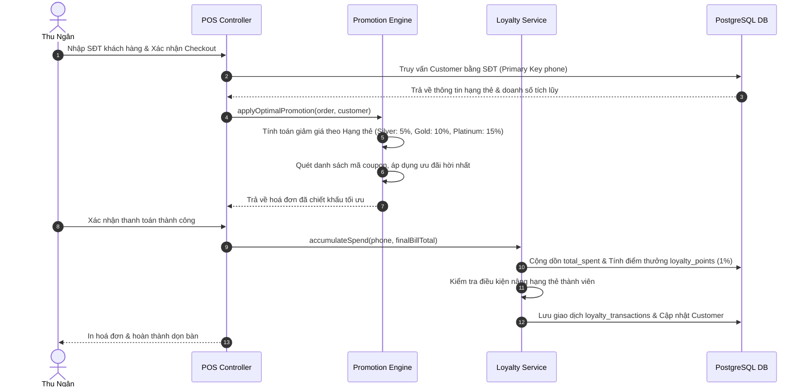

#### 4.1 Luồng Xử lý Dữ liệu Tích lũy & Thăng hạng Tự động
1. **Kiểm tra liên kết hội viên**: Tại thời điểm thanh toán hóa đơn ở POS, hệ thống kiểm tra sự tồn tại của `customer_phone` trong phiên ăn.
2. **Khấu trừ chiết khấu trực tiếp**: 
   - Hệ thống truyền thông tin khách hàng vào `PromotionEngine`. 
   - Dựa trên giá trị của trường `membership_tier` lấy từ `customers` (được truy vấn trực tiếp bằng SĐT), hệ thống tự động trừ % hóa đơn trước khi tính thuế và trước khi áp dụng coupon ngoài.
3. **Cập nhật giao dịch sau thanh toán (Post-payment Hook)**:
   - Khi trạng thái hóa đơn đổi sang `PAID`, hệ thống kích hoạt sự kiện cập nhật điểm thông qua `LoyaltyService.accumulateSpend(phone, amount)`.
   - Dịch vụ thực hiện cộng dồn `total_spent` trực tiếp trên thực thể khách hàng và lưu vết biến động vào bảng `loyalty_transactions`.
   - Một **Bộ kiểm tra thăng hạng (Tier Upgrader Component)** chạy ngay sau đó để so sánh tổng chi tiêu mới với các mốc quy định (5 triệu cho Silver, 15 triệu cho Gold, 50 triệu cho Platinum). Nếu đủ điều kiện, trường `membership_tier` được ghi nhận giá trị mới ngay lập tức, đảm bảo khách hàng được hưởng ưu đãi cao hơn ở ngay lần mua kế tiếp.

---

# 3. THIẾT KẾ CƠ SỞ DỮ LIỆU & TỪ ĐIỂN DỮ LIỆU (DATABASE DESIGN)

| --- |
| **Dự án** | Hệ Thống Quản Lý Nhà Hàng Chuỗi (RMS - Restaurant Management System) |
| **Môn học** | SWP391 - Học kỳ 5, Đại học FPT |
| **Tài liệu** | Thiết Kế Cơ Sở Dữ Liệu & Từ Điển Dữ Liệu Toàn Diện (Database Design & Dictionary) |
| **Phiên bản** | 2.0.0 (Bản Toàn Diện Đầy Đủ 43 Bảng) |
| **Tác giả** | Nhóm phát triển dự án SWP391 |
| **Trạng thái** | Hoàn tất & Sẵn sàng báo cáo |

---

Hệ thống sử dụng cơ sở dữ liệu quan hệ **PostgreSQL 16+** làm nền tảng lưu trữ chính thức. Thiết kế cơ sở dữ liệu tuân thủ nghiêm ngặt chuẩn chuẩn hóa **3NF (Third Normal Form)** nhằm triệt tiêu dư thừa dữ liệu và đảm bảo tính toàn vẹn dữ liệu ở mức tối đa.

Tài liệu này đặc tả chi tiết cấu trúc vật lý của **toàn bộ 43 bảng dữ liệu** đang hoạt động trong hệ thống. Thiết kế cơ sở dữ liệu được xây dựng hoàn thiện xoay quanh các phân hệ cốt lõi sau:
1.  **Hội viên lấy Số điện thoại (SĐT) làm định danh Khóa chính**: Loại bỏ surrogate ID `id` của bảng `customers`. Khóa chính chính thức là `phone VARCHAR(15)`. Các bảng tham chiếu ngoại như `table_sessions`, `promotion_usage`, `loyalty_transactions` đều đổi cột khóa ngoại thành `customer_phone VARCHAR(15)` tham chiếu trực tiếp đến `customers(phone)`.
2.  **Động cơ Tích lũy & Thăng hạng tự động**: Hệ thống lưu trữ `total_spent` và `loyalty_points` để tự động nâng cấp hạng thẻ (Bronze, Silver, Gold, Platinum).
3.  **Vận hành Chuỗi Đa chi nhánh (Multi-Branch)**: Các thực thể kho hàng, bàn ăn, nhân sự, hóa đơn đều được phân tách logic bằng khóa ngoại `branch_id`. Bổ sung các bảng nâng cao như `branch_product_prices` (giá chi nhánh), `internal_purchase_orders` (đơn hàng nội bộ Kho tổng), `cash_drawer_sessions` (ca két tiền mặt thu ngân), `user_branches` (gán quản lý khu vực) và `promotion_branches` (khuyến mãi theo chi nhánh).

---

## 2. Ánh Xạ Nhóm Bảng Theo Phân Hệ Nghiệp Vụ (Epic Table Mapping)

Bảng dưới đây thống kê chi tiết sự phân chia **43 bảng dữ liệu** theo từng phân hệ (Epic) để nhóm dễ dàng giải trình và thuyết trình trước giảng viên môn học:

| Nhóm Bảng Dữ Liệu | Số Bảng | Phục Vụ Cho Epic Nghiệp Vụ | Mô Tả Chức Năng Cốt Lõi |
| --- | --- | --- | --- |
| `roles`, `users`, `user_roles`, `user_sessions`, `audit_logs`, `user_branches` | 6 | **Epic 1**: Xác thực & Phân quyền | Quản lý tài khoản, mã hóa mật khẩu, phân quyền vai trò (RBAC), theo dõi phiên làm việc và lịch sử audit logs. |
| `branches`, `branch_product_prices` | 2 | **Epic 2**: Quản lý Chi nhánh | Khai báo chi nhánh chuỗi, cấu hình thực đơn và giá bán tùy chỉnh riêng lẻ theo từng cơ sở địa phương. |
| `employees`, `shift_templates`, `employee_shift_assignments`, `employee_attendances`, `leave_requests`, `forgot_clock_requests`, `payroll_runs`, `payroll_entries` | 8 | **Epic 3**: Nhân sự & Tính lương | Hồ sơ nhân viên, phân lịch trực tuần, chấm công Clock In/Out, duyệt nghỉ phép, bổ sung công và chạy lương tháng. |
| `categories`, `products`, `product_variants`, `inventory_items`, `branch_inventory`, `product_stocks` (recipes), `branch_transfers`, `branch_transfer_items`, `inventory_logs`, `internal_purchase_orders`, `internal_purchase_order_items` | 11 | **Epic 4**: Quản lý Kho & Thực đơn | Quản lý thực đơn tổng, kho nguyên vật liệu thô của từng chi nhánh, định lượng công thức (Recipe), chuyển kho nội bộ và IPO lên Kho tổng. |
| `rooms`, `tables`, `table_sessions`, `orders`, `order_details`, `cash_drawer_sessions` | 6 | **Epic 5**: Bán hàng POS & Bàn ăn | Quản lý sơ đồ bàn, phiên phục vụ, hóa đơn bán hàng POS, gộp/tách bàn ăn, cổng thanh toán VNPay và ca két tiền mặt. |
| Không có bảng riêng (Dữ liệu WebSocket đẩy trực tiếp từ `order_details` sang KDS) | 0 | **Epic 6**: Hiển thị nhà bếp KDS | Đồng bộ WebSocket đẩy thông tin món cần làm xuống bếp thời gian thực. |
| `customers`, `loyalty_transactions` | 2 | **Epic 7**: Khách hàng thành viên | Quản lý hội viên **lấy SĐT làm khóa chính**, lưu lịch sử tích điểm và thăng hạng thẻ tự động theo doanh số. |
| `suppliers`, `purchase_orders`, `purchase_order_items`, `goods_receipts`, `goods_receipt_items` | 5 | **Epic 8**: Thu mua & Đối chiếu 3 bên | Quản lý nhà cung cấp ngoài, đơn đặt mua PO, phiếu nhập kho GRN, thuật toán đối chiếu 3 bên tránh thất thoát tài chính. |
| `promotions`, `promotion_branches`, `promotion_usage` | 3 | **Epic 9**: Khuyến mãi tự động | Thiết lập mã giảm giá, combo, B1G1 có giới hạn chi nhánh và lưu vết lịch sử áp dụng coupon của khách hàng. |
| Không có bảng riêng (Truy vấn dữ liệu tổng hợp qua `AIService`) | 0 | **Epic 10**: Báo cáo & Trợ lý AI | Biểu đồ doanh thu chuỗi, báo cáo hao hụt, chatbot AI Assistant tư vấn kinh doanh tích hợp Gemini. |

---

## 3. Chi Tiết Từ Điển Dữ Liệu Của Toàn Bộ 43 Bảng (Data Dictionary)

Dưới đây là đặc tả chi tiết cấu trúc vật lý của tất cả 43 bảng trong hệ thống, được phân nhóm theo 11 phân hệ nghiệp vụ để bảo đảm tính khoa học cao nhất.

---

### 3.1 PHÂN HỆ 1: XÁC THỰC & BẢO MẬT (AUTH)

#### Bảng: roles (Vai trò phân quyền)
| Tên Cột (Column) | Kiểu Dữ Liệu | Khóa | Ràng Buộc | Mô Tả Chi Tiết |
| --- | --- | --- | --- | --- |
| id | BIGINT | PK | NOT NULL, Auto-Increment | Khóa chính tự tăng |
| name | VARCHAR(255) |  | NOT NULL, UNIQUE | Tên vai trò phân quyền (ADMIN, MANAGER, CASHIER...) |

#### Bảng: users (Tài khoản người dùng)
| Tên Cột (Column) | Kiểu Dữ Liệu | Khóa | Ràng Buộc | Mô Tả Chi Tiết |
| --- | --- | --- | --- | --- |
| id | BIGINT | PK | NOT NULL, Auto-Increment | Khóa chính tự tăng |
| email | VARCHAR(255) |  | NOT NULL, UNIQUE | Địa chỉ email dùng để đăng nhập hệ thống |
| password | VARCHAR(255) |  | NOT NULL | Mật khẩu đã được băm mã hóa BCrypt |
| name | VARCHAR(255) |  | NOT NULL | Họ tên đầy đủ của nhân viên |
| two_factor_secret | VARCHAR(255) |  | NULL | Mã khóa bí mật dùng cho ứng dụng xác thực 2FA |
| is_two_factor_enabled | BOOLEAN |  | NOT NULL, DEFAULT FALSE | Trạng thái bật/tắt bảo mật xác thực 2 yếu tố 2FA |
| is_active | BOOLEAN |  | NOT NULL, DEFAULT TRUE | Trạng thái hoạt động của tài khoản |
| failed_login_attempts | INTEGER |  | NOT NULL, DEFAULT 0 | Số lần đăng nhập sai liên tiếp để khóa tài khoản |
| branch_id | VARCHAR(36) | FK | NULL, FK -> branches(branch_id) | Chi nhánh nhân viên trực thuộc (Wildcard NULL = Admin tổng) |

#### Bảng: user_roles (Bảng liên kết Nhiều-Nhiều)
| Tên Cột (Column) | Kiểu Dữ Liệu | Khóa | Ràng Buộc | Mô Tả Chi Tiết |
| --- | --- | --- | --- | --- |
| user_id | BIGINT | PK, FK | NOT NULL, FK -> users(id) | Mã định danh tài khoản người dùng |
| role_id | BIGINT | PK, FK | NOT NULL, FK -> roles(id) | Mã định danh vai trò phân quyền |

#### Bảng: user_sessions (Phiên làm việc đăng nhập)
| Tên Cột (Column) | Kiểu Dữ Liệu | Khóa | Ràng Buộc | Mô Tả Chi Tiết |
| --- | --- | --- | --- | --- |
| id | BIGINT | PK | NOT NULL, Auto-Increment | Khóa chính tự tăng |
| user_id | BIGINT | FK | NOT NULL, FK -> users(id) | Tài khoản người dùng đăng nhập |
| token | VARCHAR(255) |  | NOT NULL, UNIQUE | Chuỗi Access Token xác thực phiên truy cập |
| ip_address | VARCHAR(50) |  | NULL | Địa chỉ IP thiết bị khi người dùng đăng nhập |
| created_at | TIMESTAMP |  | NOT NULL | Thời điểm khởi tạo phiên đăng nhập |
| expires_at | TIMESTAMP |  | NOT NULL | Thời điểm phiên đăng nhập hết hiệu lực |

#### Bảng: audit_logs (Nhật ký hoạt động bảo mật)
| Tên Cột (Column) | Kiểu Dữ Liệu | Khóa | Ràng Buộc | Mô Tả Chi Tiết |
| --- | --- | --- | --- | --- |
| id | BIGINT | PK | NOT NULL, Auto-Increment | Khóa chính tự tăng |
| user_id | BIGINT | FK | NULL, FK -> users(id) | Tài khoản nhân viên thực hiện hành động |
| user_name | VARCHAR(255) |  | NULL | Tên người dùng lưu vết trong nhật ký |
| action | VARCHAR(255) |  | NOT NULL | Tên hành động tác động (LOGIN, UPDATE_STOCK, DELETE_ORDER...) |
| object_type | VARCHAR(100) |  | NULL | Kiểu đối tượng bị tác động (USER, INVENTORY, ORDER...) |
| object_id | VARCHAR(100) |  | NULL | Mã khóa chính của đối tượng bị tác động |
| description | VARCHAR(500) |  | NULL | Mô tả chi tiết hành vi thay đổi dữ liệu |
| ip_address | VARCHAR(50) |  | NULL | Địa chỉ IP thiết bị phát sinh yêu cầu |
| created_at | TIMESTAMP |  | NOT NULL | Thời điểm phát sinh hành động ghi log |

#### Bảng: user_branches (Liên kết Quản lý khu vực - Nhiều-Nhiều)
| Tên Cột (Column) | Kiểu Dữ Liệu | Khóa | Ràng Buộc | Mô Tả Chi Tiết |
| --- | --- | --- | --- | --- |
| user_id | BIGINT | PK, FK | NOT NULL, FK -> users(id) | Mã định danh tài khoản Quản lý khu vực |
| branch_id | VARCHAR(36) | PK, FK | NOT NULL, FK -> branches(branch_id) | Chi nhánh được giao quyền giám sát |

---

### 3.2 PHÂN HỆ 2: QUẢN LÝ CHI NHÁNH (BRANCH)

#### Bảng: branches (Danh mục chi nhánh cửa hàng)
| Tên Cột (Column) | Kiểu Dữ Liệu | Khóa | Ràng Buộc | Mô Tả Chi Tiết |
| --- | --- | --- | --- | --- |
| branch_id | VARCHAR(36) | PK | NOT NULL | Khóa chính, mã UUID định danh chi nhánh |
| name | VARCHAR(255) |  | NOT NULL | Tên gọi hiển thị chi nhánh (Ví dụ: Chi nhánh Quận 1) |
| address | VARCHAR(255) |  | NULL | Địa chỉ vật lý chi tiết của chi nhánh |
| phone | VARCHAR(20) |  | NULL | Số điện thoại hotline liên hệ chi nhánh |
| is_active | BOOLEAN |  | NOT NULL, DEFAULT TRUE | Trạng thái hoạt động của chi nhánh |
| is_warehouse | BOOLEAN |  | NOT NULL, DEFAULT FALSE | Đánh dấu chi nhánh đóng vai trò là Kho tổng trung tâm |

#### Bảng: branch_product_prices (Thực đơn và Giá bán riêng theo chi nhánh)
| Tên Cột (Column) | Kiểu Dữ Liệu | Khóa | Ràng Buộc | Mô Tả Chi Tiết |
| --- | --- | --- | --- | --- |
| id | BIGINT | PK | NOT NULL, Auto-Increment | Khóa chính tự tăng |
| branch_id | VARCHAR(36) | FK | NOT NULL, FK -> branches(branch_id) | Chi nhánh áp dụng thực đơn |
| variant_id | BIGINT | FK | NOT NULL, FK -> product_variants(id) | Biến thể món ăn cấu hình |
| custom_price | DOUBLE PRECISION |  | NOT NULL | Giá bán lẻ áp dụng riêng cho chi nhánh |
| is_available | BOOLEAN |  | NOT NULL, DEFAULT TRUE | Trạng thái hiển thị món bán tại chi nhánh |

---

### 3.3 PHÂN HỆ 3: NHÂN SỰ & CHẤM CÔNG (HR)

#### Bảng: employees (Hồ sơ nhân viên)
| Tên Cột (Column) | Kiểu Dữ Liệu | Khóa | Ràng Buộc | Mô Tả Chi Tiết |
| --- | --- | --- | --- | --- |
| id | BIGINT | PK | NOT NULL, Auto-Increment | Khóa chính tự tăng |
| user_id | BIGINT | FK | NOT NULL, UNIQUE, FK -> users(id) | Tài khoản hệ thống liên kết với nhân viên |
| department | VARCHAR(100) |  | NOT NULL | Bộ phận nhân sự làm việc (Bàn, Thu ngân, Bếp...) |
| title | VARCHAR(100) |  | NOT NULL | Chức danh cụ thể (Quản lý, Phục vụ, Đầu bếp...) |
| hire_date | DATE |  | NOT NULL | Ngày nhân viên bắt đầu ký hợp đồng vào làm |
| base_salary | DOUBLE PRECISION |  | NOT NULL | Lương cơ bản làm căn cứ tính lương |
| salary_type | VARCHAR(30) |  | NOT NULL | Hình thức lương (Fixed: cố định, Hourly: tính theo giờ) |
| branch_id | VARCHAR(36) | FK | NOT NULL, FK -> branches(branch_id) | Chi nhánh làm việc chính thức của nhân viên |

#### Bảng: shift_templates (Mẫu ca trực chuẩn)
| Tên Cột (Column) | Kiểu Dữ Liệu | Khóa | Ràng Buộc | Mô Tả Chi Tiết |
| --- | --- | --- | --- | --- |
| id | BIGINT | PK | NOT NULL, Auto-Increment | Khóa chính tự tăng |
| name | VARCHAR(100) |  | NOT NULL | Tên ca làm việc (Ca sáng, Ca chiều, Ca gãy...) |
| start_time | VARCHAR(10) |  | NOT NULL | Giờ bắt đầu ca trực (Định dạng HH:mm) |
| end_time | VARCHAR(10) |  | NOT NULL | Giờ kết thúc ca trực (Định dạng HH:mm) |
| duration_hours | DOUBLE PRECISION |  | NOT NULL | Số giờ công quy đổi làm việc của ca trực |

#### Bảng: employee_shift_assignments (Phân lịch làm việc cho nhân viên)
| Tên Cột (Column) | Kiểu Dữ Liệu | Khóa | Ràng Buộc | Mô Tả Chi Tiết |
| --- | --- | --- | --- | --- |
| id | BIGINT | PK | NOT NULL, Auto-Increment | Khóa chính tự tăng |
| employee_id | BIGINT | FK | NOT NULL, FK -> employees(id) | Nhân viên được phân lịch trực |
| shift_template_id | BIGINT | FK | NOT NULL, FK -> shift_templates(id) | Ca trực được phân công |
| date | DATE |  | NOT NULL | Ngày trực cụ thể |

#### Bảng: employee_attendances (Nhật ký chấm công thực tế)
| Tên Cột (Column) | Kiểu Dữ Liệu | Khóa | Ràng Buộc | Mô Tả Chi Tiết |
| --- | --- | --- | --- | --- |
| id | BIGINT | PK | NOT NULL, Auto-Increment | Khóa chính tự tăng |
| employee_id | BIGINT | FK | NOT NULL, FK -> employees(id) | Nhân viên thực hiện chấm công |
| date | DATE |  | NOT NULL | Ngày chấm công |
| clock_in | TIMESTAMP |  | NULL | Thời điểm ghi nhận vào ca làm việc |
| clock_out | TIMESTAMP |  | NULL | Thời điểm ghi nhận ra ca làm việc |
| is_late | BOOLEAN |  | NOT NULL, DEFAULT FALSE | Đánh dấu nhân viên đi muộn so với giờ ca mẫu |
| is_early_leave | BOOLEAN |  | NOT NULL, DEFAULT FALSE | Đánh dấu nhân viên về sớm trước giờ ca mẫu |
| hours_worked | DOUBLE PRECISION |  | NOT NULL, DEFAULT 0.0 | Số giờ làm việc thực tế ghi nhận được |

#### Bảng: leave_requests (Đơn xin nghỉ phép trực tuyến)
| Tên Cột (Column) | Kiểu Dữ Liệu | Khóa | Ràng Buộc | Mô Tả Chi Tiết |
| --- | --- | --- | --- | --- |
| id | BIGINT | PK | NOT NULL, Auto-Increment | Khóa chính tự tăng |
| employee_id | BIGINT | FK | NOT NULL, FK -> employees(id) | Nhân viên xin nghỉ phép |
| start_date | DATE |  | NOT NULL | Ngày bắt đầu xin nghỉ |
| end_date | DATE |  | NOT NULL | Ngày kết thúc xin nghỉ |
| leave_type | VARCHAR(30) |  | NOT NULL | Loại nghỉ phép (ANNUAL: phép năm, SICK: ốm, UNPAID: không lương) |
| reason | VARCHAR(500) |  | NOT NULL | Lý do xin phép nghỉ phép |
| status | VARCHAR(30) |  | NOT NULL, DEFAULT 'PENDING' | Trạng thái duyệt đơn (`PENDING`, `APPROVED`, `REJECTED`) |

#### Bảng: forgot_clock_requests (Đơn giải trình quên chấm công)
| Tên Cột (Column) | Kiểu Dữ Liệu | Khóa | Ràng Buộc | Mô Tả Chi Tiết |
| --- | --- | --- | --- | --- |
| id | BIGINT | PK | NOT NULL, Auto-Increment | Khóa chính tự tăng |
| employee_id | BIGINT | FK | NOT NULL, FK -> employees(id) | Nhân viên làm đơn giải trình |
| date | DATE |  | NOT NULL | Ngày quên chấm công |
| time_proposed | VARCHAR(10) |  | NOT NULL | Giờ đề xuất bổ sung công (Định dạng HH:mm) |
| clock_type | VARCHAR(10) |  | NOT NULL | Loại quên chấm công (`IN` - Chấm vào, `OUT` - Chấm ra) |
| reason | VARCHAR(500) |  | NOT NULL | Giải trình lý do quên chấm công |
| status | VARCHAR(30) |  | NOT NULL, DEFAULT 'PENDING' | Trạng thái duyệt đơn (`PENDING`, `APPROVED`, `REJECTED`) |

#### Bảng: payroll_runs (Đợt chạy chốt lương tháng)
| Tên Cột (Column) | Kiểu Dữ Liệu | Khóa | Ràng Buộc | Mô Tả Chi Tiết |
| --- | --- | --- | --- | --- |
| id | BIGINT | PK | NOT NULL, Auto-Increment | Khóa chính tự tăng |
| period | VARCHAR(10) |  | NOT NULL | Kỳ chốt lương tháng (Định dạng YYYY-MM) |
| run_date | TIMESTAMP |  | NOT NULL | Ngày giờ thực hiện tính lương |
| run_by | VARCHAR(255) |  | NOT NULL | Tên tài khoản quản trị chạy chốt bảng lương |

#### Bảng: payroll_entries (Phiếu tính lương chi tiết nhân viên)
| Tên Cột (Column) | Kiểu Dữ Liệu | Khóa | Ràng Buộc | Mô Tả Chi Tiết |
| --- | --- | --- | --- | --- |
| id | BIGINT | PK | NOT NULL, Auto-Increment | Khóa chính tự tăng |
| payroll_run_id | BIGINT | FK | NOT NULL, FK -> payroll_runs(id) | Thuộc đợt chạy tính lương |
| employee_id | BIGINT | FK | NOT NULL, FK -> employees(id) | Nhân viên được tính lương |
| base_pay | DOUBLE PRECISION |  | NOT NULL | Lương tính theo ca trực thực tế ghi nhận |
| allowances | DOUBLE PRECISION |  | NOT NULL, DEFAULT 0.0 | Tổng các khoản phụ cấp lương cộng thêm |
| deductions | DOUBLE PRECISION |  | NOT NULL, DEFAULT 0.0 | Tổng các khoản khấu trừ lương (phạt đi trễ, nghỉ...) |
| net_pay | DOUBLE PRECISION |  | NOT NULL | Lương thực lĩnh cuối cùng nhân viên được nhận |

---

### 3.4 PHÂN HỆ 4: QUẢN LÝ KHO & THỰC ĐƠN (INVENTORY & MENU)

#### Bảng: categories (Danh mục món ăn thực đơn)
| Tên Cột (Column) | Kiểu Dữ Liệu | Khóa | Ràng Buộc | Mô Tả Chi Tiết |
| --- | --- | --- | --- | --- |
| id | BIGINT | PK | NOT NULL, Auto-Increment | Khóa chính tự tăng |
| name | VARCHAR(255) |  | NOT NULL, UNIQUE | Tên danh mục món ăn (Ví dụ: Khai vị, Lẩu, Đồ uống...) |

#### Bảng: products (Danh mục món ăn gốc)
| Tên Cột (Column) | Kiểu Dữ Liệu | Khóa | Ràng Buộc | Mô Tả Chi Tiết |
| --- | --- | --- | --- | --- |
| id | BIGINT | PK | NOT NULL, Auto-Increment | Khóa chính tự tăng |
| name | VARCHAR(255) |  | NOT NULL | Tên gọi chính thức của món ăn |
| description | TEXT |  | NULL | Mô tả chi tiết nguyên liệu, cách làm món |
| image_path | VARCHAR(255) |  | NULL | Đường dẫn ảnh của món ăn lưu trữ trên server |
| category_id | BIGINT | FK | NOT NULL, FK -> categories(id) | Thuộc danh mục món ăn nào |
| is_active | BOOLEAN |  | NOT NULL, DEFAULT TRUE | Trạng thái kinh doanh phục vụ món ăn |

#### Bảng: product_variants (Biến thể món ăn & Giá bán gốc)
| Tên Cột (Column) | Kiểu Dữ Liệu | Khóa | Ràng Buộc | Mô Tả Chi Tiết |
| --- | --- | --- | --- | --- |
| id | BIGINT | PK | NOT NULL, Auto-Increment | Khóa chính tự tăng |
| product_id | BIGINT | FK | NOT NULL, FK -> products(id) | Liên kết với sản phẩm món ăn gốc |
| name | VARCHAR(255) |  | NOT NULL | Tên biến thể (Size M, Size L, Thêm thạch...) |
| price | DOUBLE PRECISION |  | NOT NULL | Giá bán lẻ mặc định chưa chiết khấu |
| original_price | DOUBLE PRECISION |  | NOT NULL | Giá vốn sản xuất ước tính của món ăn |
| sku | VARCHAR(100) |  | NOT NULL, UNIQUE | Mã định danh quản lý bán hàng của biến thể |
| is_topping | BOOLEAN |  | NOT NULL, DEFAULT FALSE | Đánh dấu biến thể là món thêm ăn kèm |

#### Bảng: inventory_items (Danh mục nguyên liệu thô)
| Tên Cột (Column) | Kiểu Dữ Liệu | Khóa | Ràng Buộc | Mô Tả Chi Tiết |
| --- | --- | --- | --- | --- |
| id | BIGINT | PK | NOT NULL, Auto-Increment | Khóa chính tự tăng |
| sku | VARCHAR(100) |  | NOT NULL, UNIQUE | Mã quản lý kho hàng của nguyên liệu |
| name | VARCHAR(255) |  | NOT NULL | Tên gọi nguyên vật liệu thô (Bột mì, Thịt bò...) |
| unit | VARCHAR(50) |  | NOT NULL | Đơn vị tính kho (kg, lít, lon, quả...) |
| minimum_threshold | DOUBLE PRECISION |  | NOT NULL, DEFAULT 5.0 | Ngưỡng tồn kho tối thiểu an toàn chung |

#### Bảng: branch_inventory (Tồn kho thực tế của từng chi nhánh)
| Tên Cột (Column) | Kiểu Dữ Liệu | Khóa | Ràng Buộc | Mô Tả Chi Tiết |
| --- | --- | --- | --- | --- |
| id | BIGINT | PK | NOT NULL, Auto-Increment | Khóa chính tự tăng |
| branch_id | VARCHAR(36) | FK | NOT NULL, FK -> branches(branch_id) | Chi nhánh sở hữu kho |
| item_id | BIGINT | FK | NOT NULL, FK -> inventory_items(id) | Nguyên vật liệu quản lý tồn |
| quantity | DOUBLE PRECISION |  | NOT NULL, DEFAULT 0.0 | Số lượng thực tế đang tồn trong kho chi nhánh |
| reorder_point | DOUBLE PRECISION |  | NOT NULL, DEFAULT 10.0 | Mức cảnh báo tồn kho tối thiểu của chi nhánh |

#### Bảng: product_stocks (Công thức định lượng - Recipes)
| Tên Cột (Column) | Kiểu Dữ Liệu | Khóa | Ràng Buộc | Mô Tả Chi Tiết |
| --- | --- | --- | --- | --- |
| id | BIGINT | PK | NOT NULL, Auto-Increment | Khóa chính tự tăng |
| variant_id | BIGINT | FK | NOT NULL, FK -> product_variants(id) | Biến thể món ăn áp dụng công thức |
| item_id | BIGINT | FK | NOT NULL, FK -> inventory_items(id) | Nguyên vật liệu thô sử dụng |
| quantity_needed | DOUBLE PRECISION |  | NOT NULL | Số lượng nguyên liệu cần hao phí cho 1 phần ăn |

#### Bảng: branch_transfers (Phiếu điều chuyển kho liên chi nhánh)
| Tên Cột (Column) | Kiểu Dữ Liệu | Khóa | Ràng Buộc | Mô Tả Chi Tiết |
| --- | --- | --- | --- | --- |
| id | BIGINT | PK | NOT NULL, Auto-Increment | Khóa chính tự tăng |
| source_branch_id | VARCHAR(36) | FK | NOT NULL, FK -> branches(branch_id) | Chi nhánh xuất kho nguyên liệu đi |
| target_branch_id | VARCHAR(36) | FK | NOT NULL, FK -> branches(branch_id) | Chi nhánh nhận kho nguyên liệu đến |
| status | VARCHAR(30) |  | NOT NULL, DEFAULT 'PENDING' | Trạng thái chuyển (`PENDING`, `SHIPPED`, `RECEIVED`) |
| request_date | TIMESTAMP |  | NOT NULL | Ngày lập yêu cầu điều chuyển kho |
| approve_date | TIMESTAMP |  | NULL | Ngày quản lý phê duyệt phiếu xuất kho |
| shipped_date | TIMESTAMP |  | NULL | Ngày bắt đầu xuất kho vận chuyển |

#### Bảng: branch_transfer_items (Chi tiết số lượng điều chuyển kho)
| Tên Cột (Column) | Kiểu Dữ Liệu | Khóa | Ràng Buộc | Mô Tả Chi Tiết |
| --- | --- | --- | --- | --- |
| id | BIGINT | PK | NOT NULL, Auto-Increment | Khóa chính tự tăng |
| transfer_id | BIGINT | FK | NOT NULL, FK -> branch_transfers(id) | Thu thuộc phiếu điều chuyển kho nào |
| item_id | BIGINT | FK | NOT NULL, FK -> inventory_items(id) | Nguyên vật liệu điều chuyển |
| quantity_shipped | DOUBLE PRECISION |  | NOT NULL | Số lượng thực tế gửi đi từ kho nguồn |
| quantity_received | DOUBLE PRECISION |  | NULL | Số lượng thực tế nhận được tại kho đích |
| loss_quantity | DOUBLE PRECISION |  | NULL, DEFAULT 0.0 | Hao hụt trong quá trình vận chuyển |
| loss_reason | VARCHAR(255) |  | NULL | Lý do chênh lệch hao hụt hàng hóa |

#### Bảng: inventory_logs (Nhật ký biến động tồn kho chi nhánh)
| Tên Cột (Column) | Kiểu Dữ Liệu | Khóa | Ràng Buộc | Mô Tả Chi Tiết |
| --- | --- | --- | --- | --- |
| id | BIGINT | PK | NOT NULL, Auto-Increment | Khóa chính tự tăng |
| branch_id | VARCHAR(36) | FK | NOT NULL, FK -> branches(branch_id) | Chi nhánh phát sinh biến động kho |
| item_id | BIGINT | FK | NOT NULL, FK -> inventory_items(id) | Nguyên liệu thô biến động số lượng |
| change_quantity | DOUBLE PRECISION |  | NOT NULL | Số lượng biến động (+/-) |
| type | VARCHAR(30) |  | NOT NULL | Loại biến động (`STOCKIN` - Nhập, `STOCKOUT` - Xuất) |
| reason | VARCHAR(255) |  | NULL | Lý do thay đổi (Bán hàng, Điều chỉnh thủ công, Hỏng...) |
| log_date | TIMESTAMP |  | NOT NULL | Thời điểm lưu nhật ký |

#### Bảng: internal_purchase_orders (Đơn đặt hàng bổ sung nội bộ Kho tổng)
| Tên Cột (Column) | Kiểu Dữ Liệu | Khóa | Ràng Buộc | Mô Tả Chi Tiết |
| --- | --- | --- | --- | --- |
| id | BIGINT | PK | NOT NULL, Auto-Increment | Khóa chính đơn đặt hàng nội bộ |
| ipo_code | VARCHAR(50) |  | NOT NULL, UNIQUE | Mã đơn hàng nội bộ (Ví dụ: `IPO-2026-042`) |
| requester_branch_id | VARCHAR(36) | FK | NOT NULL, FK -> branches(branch_id) | Chi nhánh con yêu cầu bổ sung hàng |
| warehouse_id | VARCHAR(36) | FK | NOT NULL, FK -> branches(branch_id) | Chi nhánh Kho tổng xử lý yêu cầu |
| status | VARCHAR(30) |  | NOT NULL, DEFAULT 'SUBMITTED' | Trạng thái đơn (`DRAFT`, `SUBMITTED`, `APPROVED`, `SHIPPED`, `COMPLETED`) |
| order_date | TIMESTAMP |  | NOT NULL | Ngày tạo phiếu yêu cầu |

#### Bảng: internal_purchase_order_items (Chi tiết đặt hàng nội bộ)
| Tên Cột (Column) | Kiểu Dữ Liệu | Khóa | Ràng Buộc | Mô Tả Chi Tiết |
| --- | --- | --- | --- | --- |
| id | BIGINT | PK | NOT NULL, Auto-Increment | Khóa chính tự tăng |
| ipo_id | BIGINT | FK | NOT NULL, FK -> internal_purchase_orders(id) | Liên kết với đơn đặt nội bộ gốc |
| item_id | BIGINT | FK | NOT NULL, FK -> inventory_items(id) | Mặt hàng nguyên liệu yêu cầu |
| quantity | DOUBLE PRECISION |  | NOT NULL | Số lượng yêu cầu bổ sung |

---

### 3.5 PHÂN HỆ 5: BÁN HÀNG POS & BÀN ĂN (POS & BILLING)

#### Bảng: rooms (Khu vực / Phòng ăn nhà hàng)
| Tên Cột (Column) | Kiểu Dữ Liệu | Khóa | Ràng Buộc | Mô Tả Chi Tiết |
| --- | --- | --- | --- | --- |
| id | BIGINT | PK | NOT NULL, Auto-Increment | Khóa chính tự tăng |
| name | VARCHAR(100) |  | NOT NULL | Tên khu vực (Sân trước, Phòng lạnh lầu 1...) |
| branch_id | VARCHAR(36) | FK | NOT NULL, FK -> branches(branch_id) | Thuộc chi nhánh nào sở hữu |

#### Bảng: tables (Danh mục bàn ăn chi tiết)
| Tên Cột (Column) | Kiểu Dữ Liệu | Khóa | Ràng Buộc | Mô Tả Chi Tiết |
| --- | --- | --- | --- | --- |
| id | BIGINT | PK | NOT NULL, Auto-Increment | Khóa chính tự tăng |
| name | VARCHAR(100) |  | NOT NULL | Tên bàn ăn (Ví dụ: Bàn 01) |
| room_id | BIGINT | FK | NOT NULL, FK -> rooms(id) | Thuộc khu vực phòng ăn nào |
| status | VARCHAR(30) |  | NOT NULL, DEFAULT 'EMPTY' | Trạng thái bàn trực quan (`EMPTY`, `OCCUPIED`, `RESERVED`) |
| capacity | INTEGER |  | NOT NULL, DEFAULT 4 | Sức chứa số lượng ghế khách của bàn ăn |
| guest_count | INTEGER |  | NOT NULL, DEFAULT 0 | Số khách thực tế đang ngồi ăn tại bàn |

#### Bảng: table_sessions (Phiên phục vụ khách tại bàn ăn)
| Tên Cột (Column) | Kiểu Dữ Liệu | Khóa | Ràng Buộc | Mô Tả Chi Tiết |
| --- | --- | --- | --- | --- |
| id | BIGINT | PK | NOT NULL, Auto-Increment | Khóa chính tự tăng |
| table_id | BIGINT | FK | NOT NULL, FK -> tables(id) | Liên kết với bàn ăn vật lý |
| **customer_phone** | VARCHAR(15) | FK | NULL, FK -> customers(phone) | **Khóa ngoại liên kết số điện thoại khách hàng hội viên** |
| check_in_time | TIMESTAMP |  | NOT NULL | Thời điểm bắt đầu mở bàn phục vụ |
| check_out_time | TIMESTAMP |  | NULL | Thời điểm thanh toán đóng phiên bàn ăn |
| status | VARCHAR(30) |  | NOT NULL, DEFAULT 'ACTIVE' | Trạng thái phiên phục vụ (`ACTIVE`, `COMPLETED`, `CANCELLED`) |
| payment_status | VARCHAR(30) |  | NOT NULL, DEFAULT 'UNPAID' | Trạng thái thanh toán (`PAID`, `UNPAID`) |

#### Bảng: orders (Hóa đơn bán hàng POS)
| Tên Cột (Column) | Kiểu Dữ Liệu | Khóa | Ràng Buộc | Mô Tả Chi Tiết |
| --- | --- | --- | --- | --- |
| id | BIGINT | PK | NOT NULL, Auto-Increment | Khóa chính tự tăng |
| session_id | BIGINT | FK | NOT NULL, FK -> table_sessions(id) | Thuộc phiên bàn ăn phục vụ nào |
| order_date | TIMESTAMP |  | NOT NULL | Thời gian bắt đầu gọi món |
| status | VARCHAR(30) |  | NOT NULL, DEFAULT 'PENDING' | Trạng thái hóa đơn (`PENDING`, `COOKING`, `SERVED`, `CANCELLED`) |
| total_amount | DOUBLE PRECISION |  | NOT NULL, DEFAULT 0.0 | Tổng tiền hóa đơn thanh toán cuối cùng (sau giảm) |
| branch_id | VARCHAR(36) | FK | NOT NULL, FK -> branches(branch_id) | Chi nhánh phát sinh giao dịch bán hàng |

#### Bảng: order_details (Giỏ hàng món ăn chi tiết hóa đơn)
| Tên Cột (Column) | Kiểu Dữ Liệu | Khóa | Ràng Buộc | Mô Tả Chi Tiết |
| --- | --- | --- | --- | --- |
| id | BIGINT | PK | NOT NULL, Auto-Increment | Khóa chính tự tăng |
| order_id | BIGINT | FK | NOT NULL, FK -> orders(id) | Thuộc hóa đơn bán hàng nào |
| variant_id | BIGINT | FK | NOT NULL, FK -> product_variants(id) | Biến thể món ăn khách gọi |
| quantity | INTEGER |  | NOT NULL | Số lượng phần ăn đặt mua |
| status | VARCHAR(30) |  | NOT NULL, DEFAULT 'PENDING' | Trạng thái làm món ở bếp (`PENDING`, `COOKING`, `READY`, `SERVED`) |
| notes | VARCHAR(255) |  | NULL | Ghi chú chế biến đặc thù (Không hành, cay...) |
| price | DOUBLE PRECISION |  | NOT NULL | Đơn giá tại thời điểm giao dịch bán hàng |
| is_deducted | BOOLEAN |  | NOT NULL, DEFAULT FALSE | Trạng thái khấu trừ nguyên liệu trong kho chi nhánh |

#### Bảng: cash_drawer_sessions (Phiên ca két tiền thu ngân đối soát)
| Tên Cột (Column) | Kiểu Dữ Liệu | Khóa | Ràng Buộc | Mô Tả Chi Tiết |
| --- | --- | --- | --- | --- |
| id | BIGINT | PK | NOT NULL, Auto-Increment | Khóa chính tự tăng |
| branch_id | VARCHAR(36) | FK | NOT NULL, FK -> branches(branch_id) | Chi nhánh thu ngân trực thuộc |
| cashier_id | BIGINT | FK | NOT NULL, FK -> users(id) | Nhân viên thu ngân mở ca két |
| opening_time | TIMESTAMP |  | NOT NULL | Thời điểm mở ca bắt đầu két |
| closing_time | TIMESTAMP |  | NULL | Thời điểm chốt ca bàn giao két |
| opening_balance | DOUBLE PRECISION |  | NOT NULL | Tiền mặt ban đầu bàn giao thối thỏi |
| expected_cash | DOUBLE PRECISION |  | NOT NULL, DEFAULT 0.0 | Tiền mặt hệ thống tính toán |
| actual_cash | DOUBLE PRECISION |  | NULL | Tiền mặt thực tế thu ngân đếm cuối ca |
| discrepancy | DOUBLE PRECISION |  | NULL | Chênh lệch tiền mặt đối soát (`Actual - Expected`) |
| notes | TEXT |  | NULL | Ghi chú giải trình chênh lệch thất thoát |

---

### 3.6 PHÂN HỆ 7: KHÁCH HÀNG THÀNH VIÊN (LOYALTY)

#### Bảng: customers (Hồ sơ khách hàng thành viên)
| Tên Cột (Column) | Kiểu Dữ Liệu | Khóa | Ràng Buộc | Mô Tả Chi Tiết |
| --- | --- | --- | --- | --- |
| **phone** | VARCHAR(15) | **PK** | NOT NULL, UNIQUE | **Số điện thoại khách hàng, đóng vai trò làm Khóa chính duy nhất.** |
| name | VARCHAR(255) |  | NOT NULL | Họ tên đầy đủ của hội viên |
| birth_date | DATE |  | NULL | Ngày sinh nhật hội viên |
| membership_tier | VARCHAR(20) |  | NOT NULL, DEFAULT 'Bronze' | Hạng thẻ thành viên (Bronze, Silver, Gold, Platinum) |
| loyalty_points | INTEGER |  | NOT NULL, DEFAULT 0 | Điểm tích lũy hiện có khả dụng của khách |
| total_spent | DOUBLE PRECISION |  | NOT NULL, DEFAULT 0.0 | **Tổng chi tiêu tích lũy qua các hóa đơn (để nâng hạng thẻ)** |

#### Bảng: loyalty_transactions (Lịch sử biến động điểm thưởng)
| Tên Cột (Column) | Kiểu Dữ Liệu | Khóa | Ràng Buộc | Mô Tả Chi Tiết |
| --- | --- | --- | --- | --- |
| id | BIGINT | PK | NOT NULL, Auto-Increment | Khóa chính tự tăng |
| **customer_phone** | VARCHAR(15) | FK | NOT NULL, FK -> customers(phone) | **Khóa ngoại liên kết số điện thoại khách hàng** |
| points | INTEGER |  | NOT NULL | Số điểm biến động (+/-) |
| type | VARCHAR(30) |  | NOT NULL | Loại biến động (`EARNED` - cộng, `REDEEMED` - quy đổi tiền) |
| transaction_date | TIMESTAMP |  | NOT NULL | Thời điểm biến động điểm |
| order_id | BIGINT | FK | NULL, FK -> orders(id) | Hóa đơn liên kết phát sinh điểm thưởng |

---

### 3.7 PHÂN HỆ 8: THU MUA & NHÀ CUNG CẤP (PROCUREMENT)

#### Bảng: suppliers (Danh mục nhà cung cấp ngoài)
| Tên Cột (Column) | Kiểu Dữ Liệu | Khóa | Ràng Buộc | Mô Tả Chi Tiết |
| --- | --- | --- | --- | --- |
| id | BIGINT | PK | NOT NULL, Auto-Increment | Khóa chính tự tăng |
| code | VARCHAR(50) |  | NOT NULL, UNIQUE | Mã viết tắt nhà cung cấp (Ví dụ: `SUP-001`) |
| name | VARCHAR(255) |  | NOT NULL | Tên gọi nhà cung cấp thô |
| contact_email | VARCHAR(255) |  | NULL | Email liên hệ đặt hàng chính thức |
| phone | VARCHAR(20) |  | NULL | Số điện thoại liên hệ |
| address | VARCHAR(255) |  | NULL | Địa chỉ trụ sở nhà cung cấp |

#### Bảng: purchase_orders (Đơn đặt mua PO gửi nhà cung cấp ngoài)
| Tên Cột (Column) | Kiểu Dữ Liệu | Khóa | Ràng Buộc | Mô Tả Chi Tiết |
| --- | --- | --- | --- | --- |
| id | BIGINT | PK | NOT NULL, Auto-Increment | Khóa chính tự tăng |
| po_code | VARCHAR(50) |  | NOT NULL, UNIQUE | Mã phiếu đặt hàng tự phát sinh (Ví dụ: `PO-2026-001`) |
| supplier_id | BIGINT | FK | NOT NULL, FK -> suppliers(id) | Nhà cung cấp đặt mua hàng |
| branch_id | VARCHAR(36) | FK | NOT NULL, FK -> branches(branch_id) | Chi nhánh con nhận hàng |
| order_date | TIMESTAMP |  | NOT NULL | Ngày lập đơn mua hàng |
| delivery_deadline | DATE |  | NOT NULL | Hạn chót nhà cung cấp phải giao hàng |
| status | VARCHAR(30) |  | NOT NULL, DEFAULT 'DRAFT' | Trạng thái đơn (`DRAFT`, `APPROVED`, `RECEIVED`, `CANCELLED`) |
| total_amount | DOUBLE PRECISION |  | NOT NULL | Tổng tiền tạm tính đơn hàng nhập |

#### Bảng: purchase_order_items (Chi tiết đặt mua nguyên liệu PO)
| Tên Cột (Column) | Kiểu Dữ Liệu | Khóa | Ràng Buộc | Mô Tả Chi Tiết |
| --- | --- | --- | --- | --- |
| id | BIGINT | PK | NOT NULL, Auto-Increment | Khóa chính tự tăng |
| purchase_order_id | BIGINT | FK | NOT NULL, FK -> purchase_orders(id) | Thuộc đơn mua hàng PO nào |
| item_id | BIGINT | FK | NOT NULL, FK -> inventory_items(id) | Nguyên vật liệu thô đặt nhập |
| quantity | DOUBLE PRECISION |  | NOT NULL | Số lượng nguyên liệu đặt mua |
| unit_price | DOUBLE PRECISION |  | NOT NULL | Đơn giá nhập khẩu cam kết trong hợp đồng |

#### Bảng: goods_receipts (Phiếu kiểm nhận hàng nhập kho GRN)
| Tên Cột (Column) | Kiểu Dữ Liệu | Khóa | Ràng Buộc | Mô Tả Chi Tiết |
| --- | --- | --- | --- | --- |
| id | BIGINT | PK | NOT NULL, Auto-Increment | Khóa chính tự tăng |
| purchase_order_id | BIGINT | FK | NOT NULL, FK -> purchase_orders(id) | Liên kết với đơn đặt mua PO gốc đối soát |
| received_date | TIMESTAMP |  | NOT NULL | Ngày giờ thực nhận hàng tại kho chi nhánh |
| received_by | VARCHAR(255) |  | NOT NULL | Tên nhân viên kho thực hiện kiểm nhận |

#### Bảng: goods_receipt_items (Chi tiết kiểm nhận nhập kho GRN thực tế)
| Tên Cột (Column) | Kiểu Dữ Liệu | Khóa | Ràng Buộc | Mô Tả Chi Tiết |
| --- | --- | --- | --- | --- |
| id | BIGINT | PK | NOT NULL, Auto-Increment | Khóa chính tự tăng |
| goods_receipt_id | BIGINT | FK | NOT NULL, FK -> goods_receipts(id) | Thuộc phiếu nhập kho GRN nào |
| item_id | BIGINT | FK | NOT NULL, FK -> inventory_items(id) | Nguyên vật liệu thô thực nhận |
| quantity_received | DOUBLE PRECISION |  | NOT NULL | Số lượng thực tế đạt chất lượng nhập kho |
| quantity_rejected | DOUBLE PRECISION |  | NOT NULL, DEFAULT 0.0 | Số lượng bị lỗi từ chối nhập |
| notes | VARCHAR(255) |  | NULL | Ghi chú lý do từ chối lỗi hàng hóa |

---

### 3.8 PHÂN HỆ 9: CHƯƠNG TRÌNH KHUYẾN MÃI (PROMOTION)

#### Bảng: promotions (Cấu hình chương trình khuyến mãi)
| Tên Cột (Column) | Kiểu Dữ Liệu | Khóa | Ràng Buộc | Mô Tả Chi Tiết |
| --- | --- | --- | --- | --- |
| id | BIGINT | PK | NOT NULL, Auto-Increment | Khóa chính tự tăng |
| name | VARCHAR(255) |  | NOT NULL | Tên chương trình tiếp thị khuyến mãi |
| promo_code | VARCHAR(100) |  | NOT NULL, UNIQUE | Mã coupon giảm giá khách hàng nhập |
| type | VARCHAR(30) |  | NOT NULL | Loại ưu đãi (`PercentDiscount`, `FlatDiscount`, `Buy1Get1`) |
| discount_value | DOUBLE PRECISION |  | NOT NULL | Số tiền giảm hoặc tỷ lệ % giảm giá |
| min_order_value | DOUBLE PRECISION |  | NOT NULL, DEFAULT 0.0 | Giá trị hóa đơn tối thiểu bắt buộc để áp mã |
| max_usage_count | INTEGER |  | NOT NULL, DEFAULT 100 | Lượt dùng giới hạn tối đa của coupon |
| current_usage_count | INTEGER |  | NOT NULL, DEFAULT 0 | Lượt thực tế khách hàng đã sử dụng |
| start_date | DATE |  | NOT NULL | Ngày khuyến mãi bắt đầu có hiệu lực |
| end_date | DATE |  | NOT NULL | Ngày khuyến mãi hết hiệu lực |
| is_active | BOOLEAN |  | NOT NULL, DEFAULT TRUE | Trạng thái kích hoạt chương trình |
| trigger_product_id | BIGINT |  | NULL | Mã sản phẩm mua điều kiện kích hoạt B1G1 |
| reward_product_id | BIGINT |  | NULL | Mã sản phẩm được tặng kèm miễn phí trong B1G1 |

#### Bảng: promotion_branches (Khuyến mãi áp dụng theo chi nhánh - Nhiều-Nhiều)
| Tên Cột (Column) | Kiểu Dữ Liệu | Khóa | Ràng Buộc | Mô Tả Chi Tiết |
| --- | --- | --- | --- | --- |
| promotion_id | BIGINT | PK, FK | NOT NULL, FK -> promotions(id) | Chương trình khuyến mãi cấu hình |
| branch_id | VARCHAR(36) | PK, FK | NOT NULL, FK -> branches(branch_id) | Chi nhánh có hiệu lực áp dụng chương trình |

#### Bảng: promotion_usage (Lịch sử sử dụng khuyến mãi của khách)
| Tên Cột (Column) | Kiểu Dữ Liệu | Khóa | Ràng Buộc | Mô Tả Chi Tiết |
| --- | --- | --- | --- | --- |
| id | BIGINT | PK | NOT NULL, Auto-Increment | Khóa chính tự tăng |
| promotion_id | BIGINT | FK | NOT NULL, FK -> promotions(id) | Chương trình khuyến mãi áp dụng |
| order_id | BIGINT | FK | NOT NULL, FK -> orders(id) | Hóa đơn được chiết khấu giảm giá |
| **customer_phone** | VARCHAR(15) | FK | NULL, FK -> customers(phone) | **Khóa ngoại liên kết số điện thoại khách hàng** |
| discount_applied | DOUBLE PRECISION |  | NOT NULL | Số tiền được giảm giá thực tế |
| used_date | TIMESTAMP |  | NOT NULL | Thời điểm áp dụng chiết khấu |

---

## 4. Các Ràng Buộc Toàn Vẹn Tham Chiếu Hệ Thống (Referential Integrity Constraints)

Để bảo đảm tính nhất quán dữ liệu giao dịch chéo giữa các phân hệ (Epics), cơ sở dữ liệu thiết lập các cơ chế ràng buộc khóa ngoại (Referential Integrity) cực kỳ nghiêm ngặt:

1.  ** branches -> table_sessions / inventory / employees (`ON DELETE RESTRICT`)**: Ngăn chặn tuyệt đối việc xóa thông tin Chi nhánh khi đang có đơn hàng, tồn kho nguyên vật liệu thô hoặc nhân sự hoạt động gán cho chi nhánh đó. Điều này bảo vệ an toàn tính nhất quán dữ liệu của phân hệ Đa chi nhánh.
2.  ** orders -> order_details (`ON DELETE CASCADE`)**: Khi một hóa đơn bán hàng POS bị xóa (hoặc hủy phiên lỗi), toàn bộ các món ăn chi tiết trong hóa đơn đó tự động được xóa sạch để giải phóng bộ nhớ và tránh dữ liệu rác.
3.  ** customers -> loyalty_transactions / table_sessions (`ON DELETE RESTRICT`)**: Không cho phép xóa thông tin hội viên ra khỏi cơ sở dữ liệu nếu hội viên đó đã từng phát sinh các giao dịch tích lũy điểm thưởng hoặc có lịch sử thanh toán hóa đơn cũ nhằm bảo toàn dữ liệu báo cáo kế toán.
4.  ** purchase_orders -> goods_receipts (`ON DELETE RESTRICT`)**: Bảo toàn hồ sơ thu mua ngoài, ngăn cấm xóa đơn hàng PO khi đã lập phiếu kiểm nhận nhập kho GRN thực tế.

---

# 4. DANH SÁCH API ENDPOINTS CHI TIẾT (API DOCUMENTATION)

| --- |
| **Dự án** | Hệ Thống Quản Lý Nhà Hàng Chuỗi (RMS - Restaurant Management System) |
| **Môn học** | SWP391 - Học kỳ 5, Đại học FPT |
| **Tài liệu** | Tài Liệu Mô Tả Các Cổng Giao Tiếp API Chi Tiết (API Endpoints Documentation) |
| **Phiên bản** | 1.1.0 |
| **Tác giả** | Nhóm phát triển dự án SWP391 |
| **Trạng thái** | Sẵn sàng báo cáo |

---

Hệ thống cung cấp hệ thống endpoint phong phú phục vụ cả giao diện Web (Controller trả về Thymeleaf Template) và các API dịch vụ RESTful (RestController trả về cấu trúc dữ liệu JSON). Toàn bộ các API đều được bảo mật bởi **Spring Security** with phân quyền dựa trên vai trò (Role-Based Access Control - RBAC). 

Các API được phân tách chặt chẽ theo các phân hệ nghiệp vụ (Epics) để nhóm chúng em dễ dàng phân chia công việc phát triển độc lập.

---

## 2. Chi Tiết Danh Sách API Endpoints Theo Từng Epic

#### Epic 1: Quản lý Xác thực & Phân quyền (Authentication & Authorization)
*Mô tả*: Xử lý đăng nhập, đăng xuất, phân quyền và lưu vết audit log.

| Method | Đường dẫn (Path) | Quyền Truy Cập | Mô Tả Chức Năng Chi Tiết |
| --- | --- | --- | --- |
| GET | `/login` | Public | Trả về trang đăng nhập hệ thống. |
| POST | `/login` | Public | Spring Security tiếp nhận Email & Mật khẩu để xác thực người dùng. |
| GET | `/logout` | Authenticated | Đóng phiên làm việc hiện tại, thu hồi token. |
| GET | `/api/auth/audit-logs` | Admin | Lấy danh sách lịch sử kiểm toán hệ thống (Audit Trail) để giám sát bảo mật. |

---

#### Epic 2: Quản lý Chi nhánh & Thiết lập Hệ thống (Branch Setup & Menu Mapping)
*Mô tả*: Quản lý thông tin chi nhánh và cấu hình thực đơn bán lẻ cùng giá bán tùy biến cho từng cơ sở.

| Method | Đường dẫn (Path) | Quyền Truy Cập | Mô Tả Chức Năng Chi Tiết |
| --- | --- | --- | --- |
| GET | `/api/branches` | Admin | Lấy danh sách toàn bộ các chi nhánh hoạt động trong chuỗi. |
| POST | `/api/branches/add` | Admin | Thêm mới một chi nhánh vào chuỗi hệ thống. |
| **GET** | `/api/branches/{branchId}/menu` | Manager, Cashier | **Lấy thực đơn áp dụng riêng cho chi nhánh (gồm giá bán tùy biến lẻ).** |
| **POST** | `/api/branches/{branchId}/menu/config` | Admin, Manager | **Cấu hình giá bán tùy biến lẻ (`custom_price`) và trạng thái bán món cho chi nhánh.** |

---

#### Epic 3: Quản lý Nhân sự, Ca kíp & Tính công Lương (HR, Shifts & Payroll)
*Mô tả*: Quản lý hồ sơ nhân viên, phân ca làm việc, chấm công và tự động tính lương cứng/giờ công thực tế.

| Method | Đường dẫn (Path) | Quyền Truy Cập | Mô Tả Chức Năng Chi Tiết |
| --- | --- | --- | --- |
| GET | `/employees` | HR, Admin | Trả về trang danh sách nhân viên của chi nhánh. |
| GET | `/schedule` | HR, Manager | Trả về trang giao diện lịch làm việc và phân ca kíp của chi nhánh. |
| POST | `/api/hr/schedule/assign` | HR Officer | REST API phân lịch làm việc (Shift Template) cho nhân viên. |
| **POST** | `/api/employee/clock-in` | Employee | **REST API ghi nhận thời gian bắt đầu vào ca của nhân viên đăng nhập hiện tại.** |
| **POST** | `/api/employee/clock-out` | Employee | **REST API ghi nhận thời gian ra ca và tính số giờ công thực tế làm được.** |
| POST | `/api/hr/payroll/run` | HR Officer | Kích hoạt chạy tự động tính toán lương tháng cho nhân viên của kỳ lương chỉ định. |

---

#### Epic 4: Quản lý Kho & Định lượng Thực đơn (Inventory, Recipes & Transfers)
*Mô tả*: Định lượng món ăn, kiểm kho thực tế, chuyển kho nội bộ và đặt hàng từ chi nhánh lên Kho tổng.

| Method | Đường dẫn (Path) | Quyền Truy Cập | Mô Tả Chức Năng Chi Tiết |
| --- | --- | --- | --- |
| GET | `/inventory` | Warehouse, Manager | Trả về trang giao diện quản lý kho nguyên vật liệu và thực đơn. |
| POST | `/api/inventory/adjust` | Warehouse | Thực hiện điều chỉnh số lượng tồn kho nguyên vật liệu do hao hụt thực tế. |
| POST | `/api/inventory/recipes` | Kitchen, Manager | Thiết lập định lượng nguyên vật liệu cần dùng (`ProductStock`) cho biến thể món. |
| **POST** | `/api/procurement/ipo/create` | Branch Manager | **Chi nhánh con tạo yêu cầu bổ sung nguyên vật liệu (IPO) lên Kho tổng.** |
| **POST** | `/api/procurement/ipo/{id}/approve` | Warehouse Manager | **Kho tổng phê duyệt và chuẩn bị hàng xuất kho để vận chuyển.** |
| **POST** | `/api/inventory/transfers/{id}/ship` | Source Manager | **Xác nhận xuất kho bắt đầu vận chuyển hàng chuyển kho nội bộ.** |
| **POST** | `/api/inventory/transfers/{id}/receive` | Target Manager | **Nhận hàng chuyển kho, nhập thực tế nhận, đối soát và ghi nhận hao hụt.** |

---

#### Epic 5: Quản lý Bán hàng POS & Phiên Bàn ăn (POS & Cash Drawer Management)
*Mô tả*: Quản lý bán hàng trực tiếp tại quầy POS, kết nối thanh toán VNPay và đóng/mở két tiền mặt của thu ngân.

| Method | Đường dẫn (Path) | Quyền Truy Cập | Mô Tả Chức Năng Chi Tiết |
| --- | --- | --- | --- |
| GET | `/pos` | Cashier, Manager | Trả về trang giao diện bán hàng tại quầy POS. |
| GET | `/api/pos/session/active` | Cashier | Lấy thông tin phiên phục vụ (`TableSession`) đang hoạt động tại bàn ăn. |
| **POST** | `/api/pos/session/open` | Cashier | **Mở phiên bàn ăn mới (Liên kết số điện thoại khách hàng thành viên `customerPhone`).** |
| POST | `/api/pos/order/add` | Cashier | Thêm món ăn, biến thể và ghi chú chế biến vào giỏ hàng bàn ăn. |
| POST | `/api/pos/order/send` | Cashier | Xác nhận gửi đơn gọi món xuống bếp chế biến và đẩy WebSocket KDS. |
| POST | `/api/pos/bill/merge` | Cashier | Thực hiện gộp toàn bộ hóa đơn từ bàn nguồn sang bàn đích. |
| POST | `/api/pos/bill/split` | Cashier | Tách các món ăn đã chọn ra hóa đơn phiên ăn mới độc lập. |
| **POST** | `/api/pos/register/open` | Cashier | **Mở ca két tiền mặt mới đầu ngày, nhập số tiền mặt thối ban đầu.** |
| **POST** | `/api/pos/register/close` | Cashier | **Chốt ca két tiền mặt cuối ca, đối soát và ghi nhận chênh lệch doanh thu.** |
| POST | `/api/pos/checkout/vnpay` | Cashier | Tạo liên kết thanh toán quét mã QR qua cổng VNPay Sandbox dựa trên hóa đơn. |
| **POST** | `/api/pos/checkout/confirm` | Cashier | **Xác nhận thanh toán thành công (Tiền mặt/VNPay), cộng điểm tích lũy và in hóa đơn.** |

---

#### Epic 6: Hệ thống hiển thị nhà bếp (Kitchen Display System - KDS)
*Mô tả*: Màn hình bếp KDS tiếp nhận thông tin và cập nhật tiến độ chế biến món ăn thời gian thực.

| Method | Đường dẫn (Path) | Quyền Truy Cập | Mô Tả Chức Năng Chi Tiết |
| --- | --- | --- | --- |
| GET | `/kds` | Kitchen, Manager | Trả về trang giao diện hiển thị danh sách các món ăn cần chế biến ở bếp. |
| POST | `/api/kds/status` | Kitchen | Cập nhật tiến độ món ăn (`PENDING` -> `COOKING` -> `READY`) và phát WebSocket. |

---

#### Epic 7: Quản lý Khách hàng thành viên & Tích lũy (Loyalty & Customer Portal)
*Mô tả*: Đăng ký thành viên dựa trên SĐT làm ID chính và tra cứu điểm thưởng, hạng thẻ qua Customer Portal.

| Method | Đường dẫn (Path) | Quyền Truy Cập | Mô Tả Chức Năng Chi Tiết |
| --- | --- | --- | --- |
| **POST** | `/api/pos/customer/register` | Cashier | **REST API đăng ký hội viên mới (Nhận SĐT `phone` làm khóa chính Primary Key).** |
| **GET** | `/customer-portal/{phone}` | Public (Guest) | **Màn hình Cổng thông tin tra cứu điểm thưởng và hạng thẻ của khách hàng dựa trên SĐT.** |
| GET | `/api/loyalty/transactions/{phone}` | Cashier, Customer | Lấy lịch sử biến động điểm thưởng tích lũy/quy đổi của khách hàng. |

---

#### Epic 8: Quản lý Thu mua & Đối chiếu 3 bên (Procurement & Three-way Match)
*Mô tả*: Quản lý đặt đơn hàng PO từ nhà cung cấp ngoài, lập phiếu nhập kho GRN đối soát tài chính.

| Method | Đường dẫn (Path) | Quyền Truy Cập | Mô Tả Chức Năng Chi Tiết |
| --- | --- | --- | --- |
| GET | `/procurement` | Procurement, Admin | Trả về trang giao diện quản lý thu mua nguyên vật liệu. |
| POST | `/api/procurement/po/approve` | Manager, Admin | Phê duyệt đơn mua hàng PO để chuyển trạng thái từ DRAFT sang APPROVED. |
| POST | `/api/procurement/po/grn` | Warehouse | Lập Phiếu nhập kho (GRN) ghi nhận thực nhận hàng từ nhà cung cấp ngoài. |
| POST | `/api/procurement/po/match` | Manager, Admin | Kích hoạt đối soát 3 bên (PO vs GRN vs Hóa đơn) tự động cộng dồn tồn kho. |

---

#### Epic 9: Quản lý Khuyến mãi & Áp dụng tự động (Promotion Engine)
*Mô tả*: Thiết lập mã giảm giá, combo, B1G1 áp dụng theo chi nhánh cụ thể.

| Method | Đường dẫn (Path) | Quyền Truy Cập | Mô Tả Chức Năng Chi Tiết |
| --- | --- | --- | --- |
| GET | `/promotions` | Manager, Admin | Trả về trang giao diện quản lý các chương trình khuyến mãi. |
| POST | `/api/promotions/save` | Manager, Admin | Lưu mới hoặc cập nhật một chương trình khuyến mãi (bao gồm gán chi nhánh có hiệu lực). |

---

#### Epic 10: Báo cáo Thống kê & Trợ lý AI Assistant (BI & AI Assistant)
*Mô tả*: Báo cáo doanh số đa cơ sở và chatbot AI tư vấn kinh doanh cho ban điều hành.

| Method | Đường dẫn (Path) | Quyền Truy Cập | Mô Tả Chức Năng Chi Tiết |
| --- | --- | --- | --- |
| GET | `/dashboard` | Admin, Manager | Trả về trang chủ dashboard báo cáo thống kê BI doanh thu, nhân sự và tồn kho. |
| POST | `/api/analytics/ai-chat` | Manager, Admin | Tiếp nhận câu hỏi phân tích dữ liệu kinh doanh của Quản lý gửi đến Gemini API. |

---

