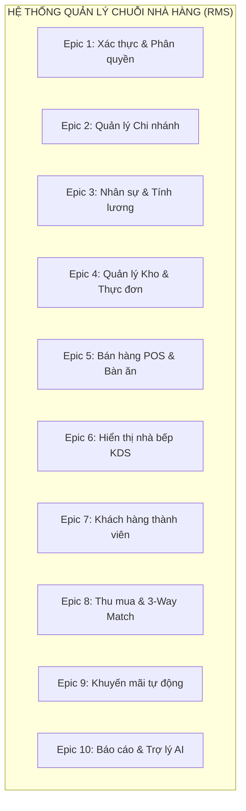

# ĐẶC TẢ YÊU CẦU PHẦN MỀM (SRS) & THIẾT KẾ USE CASE

**Hệ Thống Quản Lý Nhà Hàng Chuỗi - SWP391**

---

| Thông Tin Tài Liệu | Chi Tiết |
| --- | --- |
| **Dự án** | Hệ Thống Quản Lý Nhà Hàng Chuỗi (RMS - Restaurant Management System) |
| **Môn học** | SWP391 - Học kỳ 5, Đại học FPT |
| **Tài liệu** | Đặc tả Yêu cầu Người dùng & Các Use Case Chi Tiết (SRS & Use Cases) |
| **Phiên bản** | 1.1.0 (Bản nâng cấp Epic) |
| **Tác giả** | Technical Lead (20 năm kinh nghiệm) |
| **Trạng thái** | Sẵn sàng trình duyệt |

---

# 1. Giới Thiệu Chung (Introduction)

Tài liệu này đặc tả toàn bộ các tính năng nghiệp vụ của hệ thống **Quản lý Nhà hàng Chuỗi (RMS)**. Hệ thống được xây dựng nhằm giải quyết bài toán vận hành thực tế cho chuỗi cửa hàng ẩm thực đa cơ sở. 

Tài liệu này đặc biệt tập trung tích hợp **3 Epic nâng cấp cốt lõi** phục vụ báo cáo hội đồng chấm môn học:
1. **Quản lý khách hàng thành viên lấy Số điện thoại (SĐT) làm ID duy nhất**: Tối ưu hóa việc tra cứu và quản lý hồ sơ, loại bỏ surrogate ID.
2. **Tích lũy tổng tiền hóa đơn & Tự động áp dụng ưu đãi**: Tự động tính toán tổng chi tiêu của khách hàng (`total_spent`) để phân hạng thẻ (Bronze, Silver, Gold, Platinum) và áp dụng các chính sách chiết khấu tương ứng trực tiếp tại quầy POS.
3. **Phân hệ quản trị đa chi nhánh (Multi-branch)**: Cô lập dữ liệu tồn kho, thực đơn, doanh thu theo từng chi nhánh, đồng thời hỗ trợ luồng chuyển kho nội bộ và đặt hàng từ chi nhánh con lên Kho tổng.

---

# 2. Danh Sách Epics & Use Cases Phân Chia Theo Từng Epic

Để nhóm dễ dàng phân chia công việc (Sprint Planning) và thuyết trình trước giảng viên, các yêu cầu hệ thống được quy hoạch chặt chẽ thành **10 Epic** dưới đây.

### Epic 1: Quản lý Xác thực & Phân quyền
- **Actor**: Nhân viên, Admin, Manager.
- **Mô tả**: Đăng nhập hệ thống, cấu hình bảo mật 2 lớp (2FA), tự động khóa tài khoản khi đăng nhập sai quá 5 lần, và lưu nhật ký kiểm toán (Audit Logs).
- **Use Cases**: `UC-AUTH-01: Đăng nhập hệ thống`.

### Epic 2: Quản lý Chi nhánh & Phân công Quản trị
- **Actor**: Chủ chuỗi (Chain Admin).
- **Mô tả**: Thiết lập thông tin chi nhánh, chỉ định tài khoản Quản lý chi nhánh (Branch Admin) quản lý trực tiếp cơ sở.
- **Use Cases**: `UC-BR-01: Cấu hình thực đơn & Giá bán theo chi nhánh`.

### Epic 3: Quản lý Nhân sự, Ca kíp & Tính công Lương
- **Actor**: Nhân sự (HR Officer), Nhân viên phục vụ, Quản lý chi nhánh.
- **Mô tả**: Khai báo hồ sơ nhân sự, tạo ca làm việc mẫu, chấm công vào/ra ca (Clock In/Out), duyệt nghỉ phép, chạy bảng lương tự động hàng tháng.
- **Use Cases**: `UC-HR-02: Chấm công vào/ra ca làm việc`.

### Epic 4: Quản lý Kho & Định lượng Thực đơn
- **Actor**: Đầu bếp, Nhân viên kho, Quản lý chi nhánh.
- **Mô tả**: Thiết lập công thức định lượng món ăn (Recipe), điều chỉnh tồn kho do hao hụt thực tế, nhận cảnh báo hết hàng khi số lượng tồn xuống dưới ngưỡng an toàn.
- **Use Cases**: 
  - `UC-BR-02: Tạo phiếu đặt hàng nội bộ lên Kho tổng`
  - `UC-BR-03: Chuyển kho nội bộ và đối soát hao hụt`.

### Epic 5: Quản lý Bán hàng POS & Phiên Bàn ăn
- **Actor**: Thu ngân.
- **Mô tả**: Quản lý sơ đồ bàn ăn, mở phiên bàn ăn (Table Session), gọi món, gộp bàn (Merge Bill), tách hóa đơn (Split Bill), thanh toán VNPay QR hoặc tiền mặt.
- **Use Cases**: 
  - `UC-POS-03: Gọi món và quản lý giỏ hàng bàn ăn`
  - `UC-POS-05: Thanh toán hóa đơn và đóng phiên phục vụ`.

### Epic 6: Hệ thống hiển thị nhà bếp (KDS)
- **Actor**: Đầu bếp.
- **Mô tả**: Tiếp nhận danh sách món cần chế biến thời gian thực, cập nhật trạng thái chế biến (COOKING -> READY) đẩy thông báo WebSocket lên màn hình POS.

### Epic 7: Quản lý Khách hàng thành viên & Tích lũy (Loyalty)
- **Actor**: Thu ngân, Khách hàng.
- **Mô tả**: Đăng ký hội viên mới lấy **Số điện thoại làm ID chính**, tra cứu hạng thẻ (Membership Tier) và lịch sử tích điểm thưởng thông qua Customer Portal.
- **Use Cases**:
  - `UC-CUST-01: Đăng ký khách hàng thành viên`
  - `UC-CUST-02: Tích lũy tổng tiền hóa đơn & Tự động xếp hạng thành viên`.

### Epic 8: Quản lý Thu mua & Đối chiếu 3 bên
- **Actor**: Nhân viên mua hàng, Thủ kho, Quản lý chi nhánh.
- **Mô tả**: Lập đơn đặt mua PO gửi Supplier, nhận hàng lập phiếu nhập kho GRN, thực hiện quy trình Three-way Matching tự động đối soát tránh thất thoát tài chính.

### Epic 9: Quản lý Khuyến mãi & Áp dụng tự động
- **Actor**: Quản lý chi nhánh, Khách hàng.
- **Mô tả**: Cấu hình mã giảm giá (Flat, Percent, Buy-1-Get-1), hệ thống tự động quét giỏ hàng để áp dụng chương trình chiết khấu tối ưu nhất.

### Epic 10: Báo cáo Thống kê & Trợ lý AI Assistant
- **Actor**: Chủ chuỗi, Quản lý chi nhánh.
- **Mô tả**: Hiển thị dashboard doanh số và kho hàng đa chi nhánh, chat trực quan với AI Assistant để nhận phân tích dữ liệu kinh doanh thông minh.

---

# 3. Thiết Kế Các Use Case Chi Tiết (Use Case Specifications)

Dưới đây là đặc tả chi tiết các Use Case cốt lõi của hệ thống. Mỗi Use Case được trình bày dưới dạng bảng chuẩn hóa gồm tiền điều kiện, hậu điều kiện, luồng xử lý chính và các luồng thay thế.

---

### UC-AUTH-01: Đăng nhập hệ thống

| Đặc tính Use Case | Chi tiết đặc tả |
| --- | --- |
| **Use Case ID / Name** | **UC-AUTH-01: Đăng nhập hệ thống** |
| **Thuộc Epic** | Epic 1: Quản lý Xác thực & Phân quyền |
| **Tác nhân chính** | Mọi nhân viên (Nhân viên phục vụ, Thu ngân, Đầu bếp, HR, Quản lý, Admin) |
| **Tiền điều kiện** | Tài khoản nhân viên đã được kích hoạt trên hệ thống (`isActive = true`). |
| **Hậu điều kiện** | Tạo phiên làm việc mới, phân quyền truy cập chức năng tương ứng với vai trò. |

**Luồng xử lý chính (Main Flow):**
1. Người dùng truy cập trang đăng nhập `/login`, điền thông tin **Email** và **Mật khẩu**.
2. Người dùng nhấn nút **Đăng nhập**.
3. Hệ thống kiểm tra tài khoản trong bảng `users`:
   - Xác thực mật khẩu qua cơ chế `BCryptPasswordEncoder`.
   - Nếu đúng: Tạo bản ghi phiên làm việc trong `user_sessions`, cập nhật `failed_login_attempts = 0`.
   - Đọc các quyền hạn (Roles) của người dùng liên kết qua bảng `user_roles`.
4. Hệ thống chuyển hướng người dùng về trang chức năng tương ứng (Ví dụ: Cashier -> `/pos`, Đầu bếp -> `/kds`, Admin -> `/dashboard`). Ghi nhật ký audit log đăng nhập thành công.

**Luồng thay thế (Alternative Flow):**
- **[Alt-1] Đăng nhập thất bại (Sai mật khẩu hoặc email)**: Hệ thống tăng `failed_login_attempts` lên 1. Nếu số lần sai đạt 5, hệ thống chuyển `is_active = false`, thiết lập thời gian hết hạn khóa trong cơ sở dữ liệu và thông báo: *"Tài khoản của bạn đã bị khóa tạm thời trong 15 phút do vượt quá số lần thử đăng nhập."*

---

### UC-HR-02: Chấm công vào/ra ca làm việc

| Đặc tính Use Case | Chi tiết đặc tả |
| --- | --- |
| **Use Case ID / Name** | **UC-HR-02: Chấm công vào/ra ca làm việc** |
| **Thuộc Epic** | Epic 3: Quản lý Nhân sự, Ca kíp & Tính công Lương |
| **Tác nhân chính** | Nhân viên phục vụ / Thu ngân / Đầu bếp |
| **Tiền điều kiện** | Nhân viên đã đăng nhập hệ thống thành công và đang có ca làm việc được phân công hôm nay. |
| **Hậu điều kiện** | Bản ghi chấm công (`employee_attendances`) được khởi tạo hoặc cập nhật giờ ra ca chính xác. |

**Luồng xử lý chính (Main Flow):**
1. Nhân viên truy cập phân hệ chấm công cá nhân.
2. **Clock In (Đầu ca)**: Nhân viên nhấn nút **Clock In**:
   - Hệ thống ghi nhận thời gian hiện tại vào cột `clock_in` trong bảng `employee_attendances`.
   - So sánh với giờ bắt đầu trong `shift_templates`. Nếu đến trễ hơn ca quy định, tự động đánh dấu `is_late = true`.
3. **Clock Out (Cuối ca)**: Hết ca làm việc, nhân viên nhấn nút **Clock Out**:
   - Hệ thống tìm kiếm bản ghi chấm công đang mở của ngày hôm nay.
   - Ghi nhận thời gian hiện tại vào cột `clock_out`.
   - Tính toán số giờ làm việc thực tế (`hours_worked`) và kiểm tra xem có về sớm không để đánh dấu `is_early_leave = true`.
4. Trả về thông báo ghi nhận thành công và hiển thị tổng số giờ công tạm tính.

---

### UC-POS-03: Gọi món và quản lý giỏ hàng bàn ăn

| Đặc tính Use Case | Chi tiết đặc tả |
| --- | --- |
| **Use Case ID / Name** | **UC-POS-03: Gọi món và quản lý giỏ hàng bàn ăn** |
| **Thuộc Epic** | Epic 5: Quản lý Bán hàng POS & Bàn ăn |
| **Tác nhân chính** | Thu ngân (hoặc Nhân viên phục vụ tại bàn) |
| **Tiền điều kiện** | Bàn ăn đã được mở phiên làm việc (`table_sessions.status = 'ACTIVE'`). |
| **Hậu điều kiện** | Các bản ghi `order_details` được cập nhật món và số lượng tương ứng chính xác. |

**Luồng xử lý chính (Main Flow):**
1. Thu ngân chọn bàn ăn trên sơ đồ màn hình POS.
2. Thu ngân nhấp vào danh mục món ăn (Category) và chọn một sản phẩm cùng các tùy chọn biến thể (Size, Đá, Nóng, Topping).
3. Thu ngân nhấn **Thêm vào giỏ**:
   - Hệ thống gọi API `POST /api/pos/order/add`.
   - Kiểm tra xem sản phẩm đã có trong phiên gọi món hiện tại chưa. Nếu có, tăng số lượng `quantity`. Nếu chưa, tạo dòng `order_details` mới.
4. Hệ thống chạy cơ chế khuyến mãi tự động `PromotionEngine.processBuyOneGetOne`: Nếu đơn hàng chứa sản phẩm kích hoạt (Ví dụ: Mua 1 Ly Cà Phê Sữa Size Lớn), hệ thống tự động thêm món tặng (Ví dụ: Bánh Flan ngọt) với đơn giá `0.0` và đánh dấu `is_deducted = false`.
5. Thu ngân xác nhận và nhấn nút **Gửi bếp** để đẩy thông tin sang KDS.

---

### UC-POS-05: Thanh toán hóa đơn và đóng phiên phục vụ

| Đặc tính Use Case | Chi tiết đặc tả |
| --- | --- |
| **Use Case ID / Name** | **UC-POS-05: Thanh toán hóa đơn và đóng phiên phục vụ** |
| **Thuộc Epic** | Epic 5: Quản lý Bán hàng POS & Bàn ăn |
| **Tác nhân chính** | Thu ngân |
| **Tiền điều kiện** | Phiên bàn ăn đang hoạt động và có ít nhất 1 món ăn trong hóa đơn. |
| **Hậu điều kiện** | Thanh toán thành công, giải phóng trạng thái bàn ăn, tự động cộng điểm tích lũy cho khách hàng. |

**Luồng xử lý chính (Main Flow):**
1. Thu ngân nhấn nút **Checkout (Thanh toán)** trên màn hình POS.
2. Hệ thống thực hiện các tính toán sau:
   - Tính tổng tiền món ăn tạm tính (`total_amount`).
   - Kiểm tra xem phiên bàn ăn có liên kết số điện thoại khách hàng thành viên không. Nếu có, tự động áp dụng chính sách chiết khấu theo thứ tự ưu đãi: **Membership Discount** (Bronze: 0%, Silver: 5%, Gold: 10%, Platinum: 15% trừ thẳng hóa đơn) kết hợp quét mã giảm giá hời nhất qua `PromotionEngine.applyOptimalPromotion`.
3. Thu ngân chọn phương thức thanh toán: **Tiền mặt** hoặc **Quét mã VNPay QR**.
4. Khi nhận được xác nhận thanh toán thành công (hoặc phản hồi IPN từ VNPay):
   - Cập nhật hóa đơn `orders.status = 'SERVED'`.
   - Cập nhật phiên bàn ăn `table_sessions.status = 'COMPLETED'`, `payment_status = 'PAID'`.
   - Giải phóng bàn ăn: `tables.status = 'EMPTY'`, `guest_count = 0`.
   - Gọi hàm `LoyaltyService.accumulateSpend(phone, billTotal)`: Cộng dồn `total_spent` của khách hàng theo số điện thoại, tự động kích hoạt nâng hạng thành viên nếu vượt ngưỡng chi tiêu, và cộng điểm tích lũy (1% tổng hóa đơn).
5. Hệ thống in hóa đơn (Receipt) cho khách hàng và đóng phiên bàn ăn.

---

### UC-CUST-01: Đăng ký khách hàng thành viên

| Đặc tính Use Case | Chi tiết đặc tả |
| --- | --- |
| **Use Case ID / Name** | **UC-CUST-01: Đăng ký khách hàng thành viên** |
| **Thuộc Epic** | Epic 7: Quản lý Khách hàng thành viên & Tích lũy (Loyalty) |
| **Tác nhân chính** | Thu ngân |
| **Tiền điều kiện** | Khách hàng chưa có tài khoản thành viên trong hệ thống. |
| **Hậu điều kiện** | Tạo mới bản ghi khách hàng với khóa chính là Số điện thoại trên cơ sở dữ liệu. |

**Luồng xử lý chính (Main Flow):**
1. Khi khách hàng mua hàng tại quầy và có nhu cầu tích điểm, Thu ngân mở biểu mẫu đăng ký hội viên (`POST /api/pos/customer/register`).
2. Thu ngân nhập các thông tin do khách cung cấp: **Số điện thoại (SĐT)**, **Họ tên**, và **Ngày sinh** (tùy chọn).
3. Thu ngân nhấn **Xác nhận đăng ký**.
4. Hệ thống kiểm tra tính hợp lệ:
   - Kiểm tra xem Số điện thoại đã tồn tại trong bảng `customers` chưa (tra cứu trực tiếp bằng khóa chính `phone`).
   - Nếu chưa tồn tại: Tạo thực thể `Customer` mới với `phone` làm khóa chính. Thiết lập giá trị mặc định: `membership_tier = 'Bronze'`, `loyalty_points = 0`, `total_spent = 0.0`.
5. Hệ thống trả về thông báo đăng ký thành công. Kể từ hóa đơn này, khách hàng có thể đọc SĐT để nhân viên nhập trực tiếp khi mở bàn ăn nhằm tích lũy doanh số.

**Luồng thay thế (Alternative Flow):**
- **[Alt-1] Trùng số điện thoại**: Nếu hệ thống phát hiện số điện thoại đã tồn tại làm khóa chính, hệ thống sẽ trả về lỗi: *"Số điện thoại này đã được đăng ký thành viên trước đó. Họ tên hội viên: Nguyễn Văn A. Hạng thẻ: Silver."* và hiển thị thông tin để thu ngân liên kết ngay vào bàn ăn mà không cần tạo mới.

---

### UC-CUST-02: Tích lũy tổng tiền hóa đơn & Tự động xếp hạng thành viên

| Đặc tính Use Case | Chi tiết đặc tả |
| --- | --- |
| **Use Case ID / Name** | **UC-CUST-02: Tích lũy tổng tiền hóa đơn & Tự động xếp hạng** |
| **Thuộc Epic** | Epic 7: Quản lý Khách hàng thành viên & Tích lũy (Loyalty) |
| **Tác nhân chính** | Hệ thống (Tự động kích hoạt khi thanh toán hóa đơn hoàn tất) |
| **Tiền điều kiện** | Đơn hàng của bàn ăn được liên kết với số điện thoại của hội viên hoạt động. |
| **Hậu điều kiện** | Cập nhật `total_spent`, tự động nâng hạng thẻ (`membership_tier`) và điểm tích lũy của hội viên. |

**Luồng xử lý chính (Main Flow):**
1. Khi có sự kiện thanh toán hóa đơn hoàn tất (trong `UC-POS-05`), hệ thống nhận giá trị tổng tiền thanh toán thực tế của khách (`total_amount`).
2. Hệ thống gọi hàm dịch vụ `LoyaltyService.accumulateSpend(String phone, Double amount)`:
   - Truy vấn thông tin khách hàng từ bảng `customers` bằng khóa chính `phone`.
   - Thực hiện cộng dồn: `new_total_spent = total_spent + amount`.
   - Tính điểm thưởng mới: `loyalty_points = loyalty_points + (amount * 0.01)` (1% số tiền hóa đơn quy đổi thành điểm).
   - Lưu một giao dịch tích lũy điểm thưởng vào bảng `loyalty_transactions` với loại `EARNED`.
3. Hệ thống thực hiện kiểm tra thăng hạng thẻ tự động dựa trên tổng chi tiêu tích lũy (`new_total_spent`):
   - Nếu `new_total_spent >= 50.000.000 VNĐ`: Nâng cấp lên **Platinum** (Ưu đãi giảm 15% hóa đơn sau).
   - Nếu `new_total_spent >= 15.000.000 VNĐ` và `< 50.000.000 VNĐ`: Nâng cấp lên **Gold** (Ưu đãi giảm 10% hóa đơn sau).
   - Nếu `new_total_spent >= 5.000.000 VNĐ` và `< 15.000.000 VNĐ`: Nâng cấp lên **Silver** (Ưu đãi giảm 5% hóa đơn sau).
   - Nếu `< 5.000.000 VNĐ`: Hạng thẻ giữ nguyên là **Bronze** (Giảm 0%).
4. Cập nhật các trường thông tin thay đổi vào bảng `customers` trong cơ sở dữ liệu. Ghi nhật ký audit log thăng hạng nếu hạng thẻ của hội viên có sự thay đổi.

---

### UC-BR-01: Cấu hình thực đơn & Giá bán theo chi nhánh

| Đặc tính Use Case | Chi tiết đặc tả |
| --- | --- |
| **Use Case ID / Name** | **UC-BR-01: Cấu hình thực đơn & Giá bán theo chi nhánh** |
| **Thuộc Epic** | Epic 2: Quản lý Chi nhánh & Phân công Quản trị |
| **Tác nhân chính** | Chủ chuỗi (Chain Admin) / Quản lý chi nhánh (Branch Manager) |
| **Tiền điều kiện** | Các chi nhánh (`branches`) và biến thể thực đơn (`product_variants`) đã được khai báo trên hệ thống. |
| **Hậu điều kiện** | Giá bán và trạng thái món được áp dụng riêng biệt cho từng chi nhánh cụ thể thành công. |

**Luồng xử lý chính (Main Flow):**
1. Quản lý truy cập trang cấu hình thực đơn chi nhánh (`/inventory/menu`).
2. Quản lý chọn chi nhánh mục tiêu cần cấu hình (Nếu là Branch Manager, hệ thống tự động khóa và chọn chi nhánh hiện tại mà tài khoản được gán trong bảng `users.branch_id`).
3. Hệ thống hiển thị danh sách toàn bộ các món ăn và biến thể.
4. Quản lý chọn một biến thể món ăn (`ProductVariant`) và thực hiện cấu hình:
   - Điền giá bán lẻ áp dụng riêng cho chi nhánh (`custom_price`) để bù đắp sự chênh lệch chi phí vận hành địa phương.
   - Bật hoặc tắt trạng thái kinh doanh (`is_available = true/false`) tùy thuộc vào nguồn cung nguyên liệu thô tại địa phương.
5. Quản lý nhấn **Lưu cấu hình**:
   - Hệ thống ghi nhận thông tin vào bảng liên kết `branch_product_prices`.
   - Kể từ thời điểm này, khi thu ngân chi nhánh mở màn hình POS gọi món, hệ thống sẽ truy vấn bảng `branch_product_prices` trước để hiển thị giá bán tùy biến thay vì lấy giá gốc mặc định trong bảng `product_variants`.

---

### UC-BR-02: Tạo phiếu đặt hàng nội bộ lên Kho tổng

| Đặc tính Use Case | Chi tiết đặc tả |
| --- | --- |
| **Use Case ID / Name** | **UC-BR-02: Tạo phiếu đặt hàng nội bộ lên Kho tổng** |
| **Thuộc Epic** | Epic 4: Quản lý Kho & Định lượng Thực đơn |
| **Tác nhân chính** | Quản lý chi nhánh con (Branch Manager) |
| **Tiền điều kiện** | Chi nhánh Kho tổng đã được định nghĩa (`branches.is_warehouse = true`). Tồn kho chi nhánh con xuống thấp. |
| **Hậu điều kiện** | Phiếu yêu cầu đặt hàng nội bộ (IPO) được gửi lên Kho tổng thành công ở trạng thái `SUBMITTED`. |

**Luồng xử lý chính (Main Flow):**
1. Hệ thống gửi thông báo cảnh báo đến Quản lý chi nhánh khi số lượng tồn kho nguyên liệu trong bảng `branch_inventory` tụt dưới ngưỡng cảnh báo `reorder_point`.
2. Quản lý chi nhánh con nhấp vào thông báo và chọn chức năng **Đặt hàng nội bộ lên Kho tổng** (`POST /api/procurement/ipo/create`).
3. Quản lý chọn danh sách các nguyên vật liệu thô cần bổ sung từ bảng `inventory_items` và điền số lượng tương ứng.
4. Quản lý nhấn **Gửi yêu cầu bổ sung**:
   - Hệ thống tự động tạo mã đơn hàng nội bộ duy nhất `ipo_code` (Ví dụ: `IPO-2026-004`).
   - Thiết lập `requester_branch_id` là mã chi nhánh con hiện tại, `warehouse_id` là mã chi nhánh Kho tổng.
   - Ghi nhận trạng thái phiếu `status = 'SUBMITTED'` và lưu vào bảng `internal_purchase_orders` cùng chi tiết trong `internal_purchase_order_items`.
5. Đơn hàng nội bộ được chuyển tiếp sang danh sách hàng chờ xử lý của Thủ kho Kho tổng để lên phương án chuẩn bị xuất hàng.

---

### UC-BR-03: Chuyển kho nội bộ và đối soát hao hụt

| Đặc tính Use Case | Chi tiết đặc tả |
| --- | --- |
| **Use Case ID / Name** | **UC-BR-03: Chuyển kho nội bộ và đối soát hao hụt** |
| **Thuộc Epic** | Epic 4: Quản lý Kho & Định lượng Thực đơn |
| **Tác nhân chính** | Quản lý chi nhánh xuất (Kho nguồn) và Quản lý chi nhánh nhận (Kho đích) |
| **Tiền điều kiện** | Phiếu chuyển kho đã được tạo lập ở trạng thái chờ gửi đi. |
| **Hậu điều kiện** | Tồn kho của 2 chi nhánh được cập nhật, ghi nhận chênh lệch hao hụt trong quá trình vận chuyển. |

**Luồng xử lý chính (Main Flow):**
1. **Bước 1 (Xuất kho đi)**: Quản lý chi nhánh xuất kiểm đếm hàng hóa thực tế và nhấn nút **Xác nhận gửi đi** (`POST /api/inventory/transfers/{id}/ship`):
   - Hệ thống tự động giảm ngay lập tức số lượng nguyên liệu tương ứng trong bảng `branch_inventory` của chi nhánh xuất.
   - Chuyển trạng thái phiếu chuyển kho `branch_transfers.status = 'SHIPPED'`, cập nhật `shipped_date` và ghi nhận số lượng gửi đi `quantity_shipped`. Lượng hàng này chính thức nằm ở trạng thái đang vận chuyển (In-transit).
2. **Bước 2 (Nhận kho & Đối soát)**: Khi hàng hóa được vận chuyển đến chi nhánh nhận, Quản lý chi nhánh nhận kiểm đếm số lượng thực tế nhận được và điền thông tin vào biểu mẫu:
   - Nhập số lượng thực nhận (`quantity_received`).
   - Nhập lý do hao hụt (`loss_reason`) nếu có sự chênh lệch do hư hỏng, rơi vỡ trong quá trình vận chuyển.
3. Quản lý chi nhánh nhận nhấn nút **Hoàn tất nhập kho** (`POST /api/inventory/transfers/{id}/receive`):
   - Hệ thống tính toán hao hụt: `loss_quantity = quantity_shipped - quantity_received`.
   - Hệ thống cộng số lượng thực nhận `quantity_received` vào tồn kho trong bảng `branch_inventory` của chi nhánh đích.
   - Ghi nhật ký lịch sử thay đổi tồn kho `inventory_logs` cho cả 2 chi nhánh (`STOCKOUT` tại kho nguồn và `STOCKIN` tại kho đích).
   - Đổi trạng thái phiếu chuyển kho sang `status = 'RECEIVED'`.
